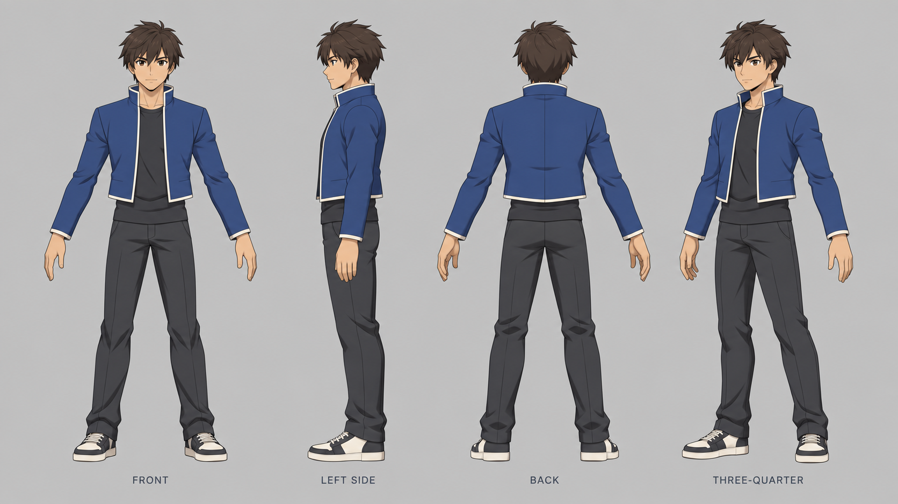
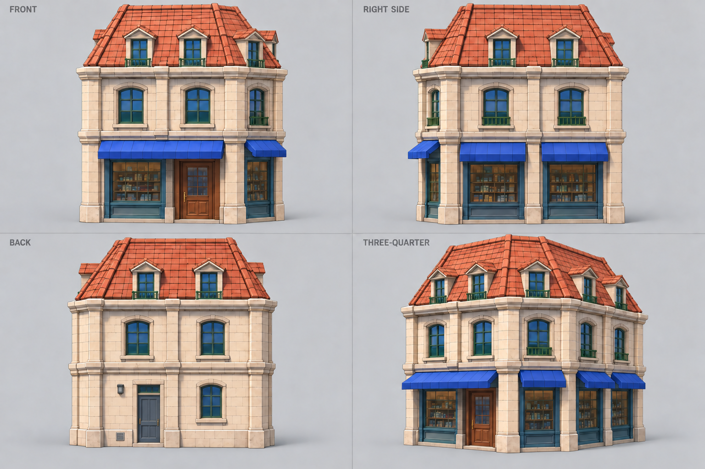
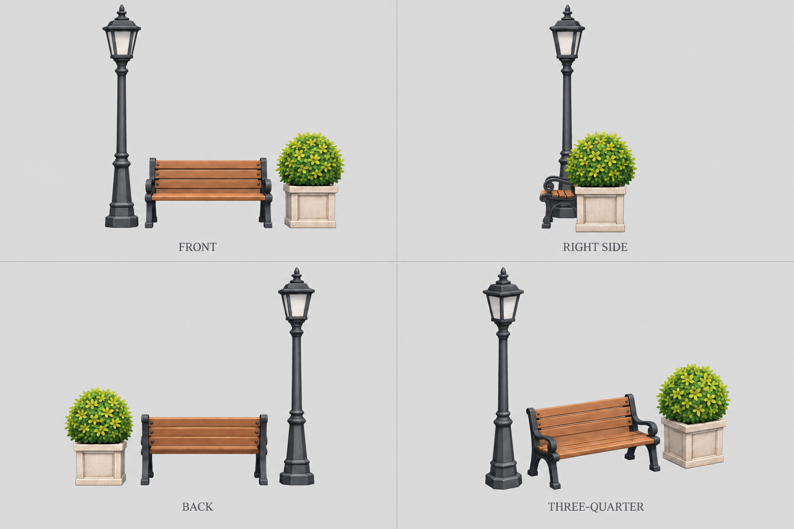

# Benchmark generation inputs — #96

Owner: gpt-astra. Status: awaiting director approval. Parent phase: #94.
Created with built-in image generation, 2026-09-22. These are reference
sheets, not production meshes or evidence that the 3D pipeline works.

## Review sheets

### Character A

Source: [approved male turnaround](../characters/turnaround_a.png).
Preserves dark tousled hair, cobalt jacket with ivory piping, charcoal shirt
and trousers, and two-tone sneakers. Front, left side, back, three-quarter.
Use approximately seven heads and 1.70 m as the modelling target. No disk:
it is a separate asset. Side view follows the original relaxed arm pose;
normalize to the shared rig pose in Blender before skinning.

### Blue-awning shop

Sources: [exploration concept](../../../docs/art/concepts/world-exploration-v02.png)
and [street-duel concept](../../../docs/art/concepts/street-duel-key-visual-v02.png).
Preserves cream masonry, cobalt awnings, dark teal window frames, wooden
entrance, green rails and terracotta dormered roof. Front, right side, back,
three-quarter. The continuous front awning spans the window and entrance;
chamfer and right-side awnings are separate.

The concepts do not establish a complete measured building. This sheet
proposes a consistent corner-shop interpretation, including an unseen rear
service elevation. Rear door, vent and wall light are inferred details for
approval. Start at approximately 7 m overall height; establish final width,
depth and door clearance against the benchmark character in Blender.

### Street-corner props

Source: [exploration concept](../../../docs/art/concepts/world-exploration-v02.png).
One charcoal lantern streetlamp, one wood/metal garden bench and one pale
stone shrub planter. The grouping is a proposed assembly of props visible
separately in the concept, not an exact location from the district map.
Front, right side, back, three-quarter. In the side view the planter overlaps
the bench, with the lamp behind; use the other views to resolve occlusion.
Proposed scale: lamp 3 m, bench seat 0.45 m, bench back 0.9 m,
planter 0.65 m and shrub top approximately 1.25 m. Normalize these in Blender;
image generation does not guarantee metric ratios or exact projections.

## Handoff and limits

- Director: approve fidelity, shop rear interpretation and prop selection.
  #96 remains open until approval; this delivery does not close parent #94.
- Fable: #95 owns generator enablement, service/plan terms and the actual
  round trip; #97 owns the repeatable concept/render comparison scene.
- Astra: use these after approval for the benchmark tasks. Select individual
  view panels for a generator that expects one view per input; never feed a
  whole multi-view sheet as though it depicted several separate assets.
- Treat front views as the silhouette/color anchor, other views as guidance.
  Small generated differences in seams, foliage and perspective must be
  reconciled in one coherent 3D mesh. These are not calibrated orthographics.
- Preserve the original approved concepts. Do not substitute the current
  greybox as the quality target or start production before the benchmark gate.

## Provenance and verification

The three PNGs are newly generated SOLOSRC reference artwork, supplied under
the repository MIT license. Only existing original repository concepts were
provided as image inputs; no external reference images were copied here.
[Exact prompts](prompts.json) record the initial requests and targeted edits.
The first shop and prop attempts are discarded variants, not delivery inputs.
This provenance does not decide the terms of Hunyuan3D or Rodin output (#95).

Visually reviewed all twelve views for full framing, palette, silhouette and
major features. Corrected the shop awning segmentation and prop background /
side projection. Character sheet: 1672 × 941; environment sheets: 1536 × 1024.
No runtime changes; engine tests are not applicable to these reference sheets.
