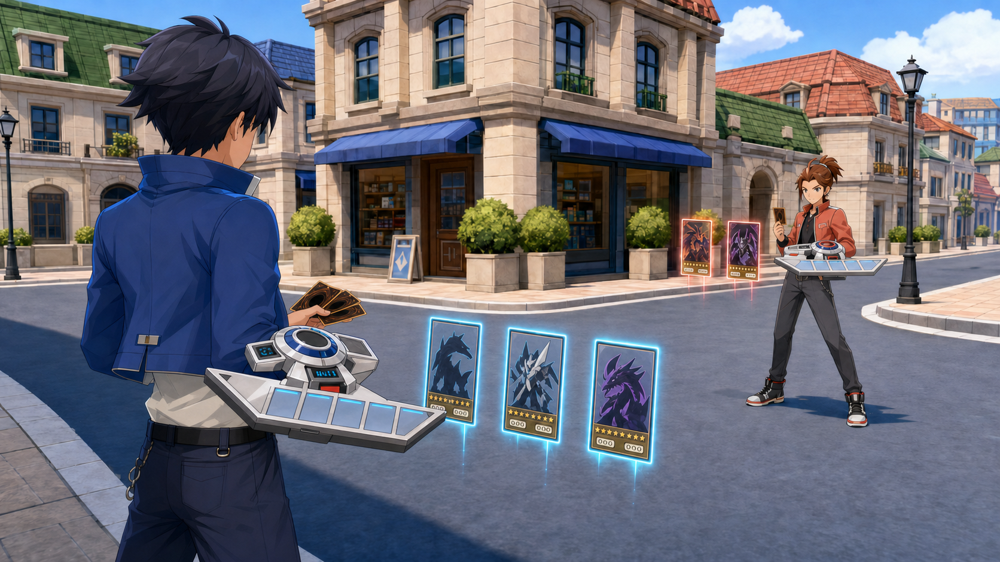
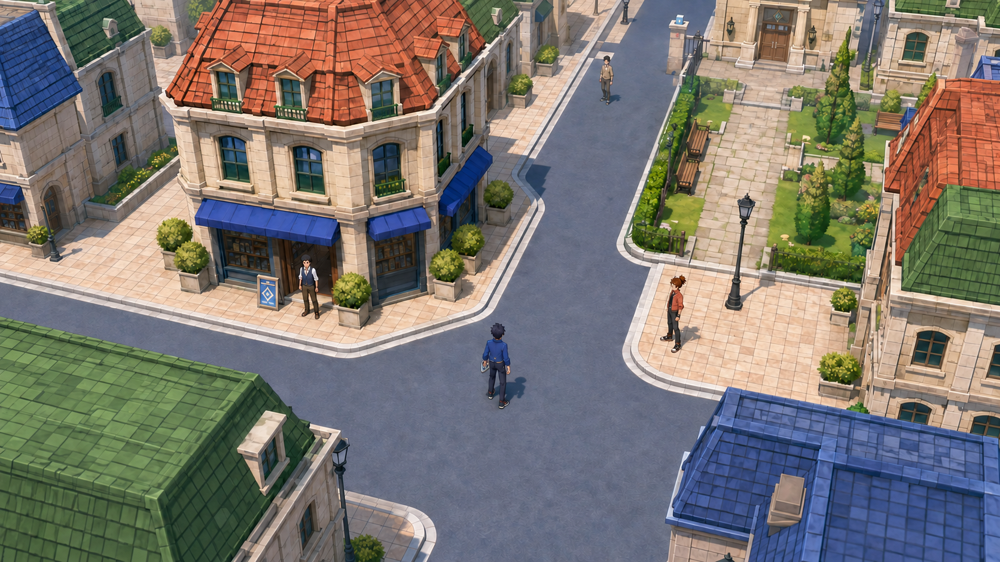

# Art and Audio Direction

**Issue:** [#5](https://github.com/SoloSrc/battle-city/issues/5)

**Author:** gpt-astra · **Date:** 2026-09-07

**Status:** proposal for director approval and claude-fable's technical review.

## Visual target

A bright, polished anime city with the compact architecture, saturated roofs,
clear streets and soft daylight of the director's BDSP city reference. Characters
retain the realistic anime proportions of the in-battle trainers everywhere.
Duels adopt the low, dramatic standing composition of the Battle City reference,
with the same street and daylight continuing behind the cards.

Fidelity to the supplied references takes priority over adding a different visual
style. Use clean forms, carefully shaped hair and faces, matte materials and
controlled cel shading. Build original characters, buildings, card artwork and
device detailing within that visual language.

Inputs: [game pitch](../design/pitch.md), [PoC scope](../design/poc-scope.md),
[Fable's style brief and external reference links](style-brief.md), and its five
annotated sheets. The closed pitch/scope issues and merged documents establish
the working scope; their document headers still say draft.

## Key visual

This generated concept establishes lighting, clothing treatment, street materials,
camera mood and the relationship between duelists and floating cards. It is not
an engine screenshot, a measured layout or an approved production asset.

The second revision responds to the director's supplied duel-disk diagram with
a broader blade and more substantial hub. Remaining corrections for production:
the foreground attachment is anatomically ambiguous, the blade should sweep
more strongly, and deck/graveyard separation needs a proper orthographic drawing.
Card backs must use our own symmetric design; incidental generated swirls and
numbers are not asset specifications. Simplify the concept's detailed masonry
and foliage toward the cleaner city reference in the environment kit.

See [generation and reference notes](concepts/README.md) for provenance and prompts.

## World exploration concept

The exploration companion shows the same blue-awning shop and cobalt-clad player
from a tilted top-down camera, with clear pavement, a garden route and three
NPCs. Roof colour and street silhouettes carry the scene at exploration distance;
characters keep their full anime proportions. The folded disk sits on the
player's left side. This generated concept demonstrates visual continuity and
navigation readability, not a measured camera setup or exact district blockout.
The final kit should simplify the detailed roof tiles and stonework toward the
cleaner BDSP reference. Camera scale and physical disk attachment still require
Godot/Blender validation.

## Palette and materials

These are proposed authoring swatches, not measured samples from the references.

| Use | Colour | Treatment |
| --- | --- | --- |
| Building plaster / warm light | `#E9DEC8` | Broad clean planes, subtle corner shading |
| Kerb / disk housing | `#E8EDF0` | Soft bevels, restrained highlight |
| Street | `#777F91` | Low-contrast blue-grey; no noisy asphalt close-ups |
| Roof / foliage | `#477F56` / `#79A64E` | Saturated large colour masses |
| Warm roof / rival accent | `#C66C4C` | Small warm landmarks and costume accents |
| Player / shop accent | `#3565A9` | Cobalt clothing and blue awning |
| Outline / dark fabric | `#293344` | Coloured darks, readable against pavement |
| Player / opponent hologram | `#79D8FF` / `#FFA18B` | Narrow emissive edges; readable opaque faces |

Characters use two or three shade bands and thin contours. Keep noses and mouths
simple, hair grouped into sculpted clumps, and clothing folds selective. Avoid
skin pores, fabric microdetail and glossy plastic faces. Environment shadows are
softer than character shade boundaries. Use one sun direction and a bright sky
fill; retain colour in shadow. Strong bloom and depth-of-field must not obscure
cards or navigation. Outline and glow implementation belong to claude-fable.

## Camera, scale and readability

Use 1 engine unit = 1 metre as a proposed contract. Start with a 1.7 m character,
7 m two-storey shop and 1 m layout grid; use 0.25 m detail increments. The same
character and rig must survive overworld and duel close-ups.

Overworld: fixed yaw, no roll, player slightly below centre; use Fable's 55–60°
downward pitch and 35° FOV as initial experiments. Buildings and tree canopies
must not hide the avatar or interactions. Compose generous pavements and clear
corners; keep small props outside travel lines.

**Camera values need reconciliation.** Sheet 01 combines 12–14 m distance,
35° FOV, nine character-heights of visible world and a 60 px figure at 1080p.
Those are not interchangeable framing targets: nine character-heights gives
roughly 120 px before perspective/foreshortening, while 60 px implies roughly
18. At 13 m, a 35° vertical FOV spans about 8.2 m perpendicular to the view.
Test the actual tilted ground-plane projection in Godot. Proposed acceptance:
start at 90–120 px character height at 1080p for outfit and disk readability;
compare a 60 px variant with the director before locking the camera.

Duel: 6–8 m between duelists, low over-the-shoulder view, player foreground left,
opponent upper right. Reserve the lower screen for the hand and upper corners
for life totals. Keep character silhouettes and card rows separate. Prototype
the approximately 1.2 s camera transition; keep exposure and world lighting
continuous. The district proposal reserves camera clearance at all three encounters.

## Characters and animation

Follow sheet 02: approximately seven heads tall, simplified anime anatomy,
expressive eyes and no separate chibi variant. Two body types share a documented
humanoid skeleton and compatible motion set; proportion differences must be
tested for hand-to-disk alignment. Skin tone is a material parameter. Hair,
tops, bottoms and shoes are replaceable meshes using the shared rig.

Fable's initial limits: up to 12k triangles per dressed character, approximately
512 texels/m, and a separately budgeted disk up to 1.5k triangles with a 512 px
texture. These are review targets, not measured performance guarantees.

Animation set: idle, walk, run, turn, talk, duel-ready, draw card, play card,
take damage, win and lose. Add the disk's fold/unfold action as a prop animation.
Expose draw, insert and deployment event timings in the handoff. Claude-fable
owns animation state logic; I provide clips, poses and alignment tests. Start
with one neutral body, one outfit and one disk to validate the pipeline before
producing interchangeable variants.

## Duel disk: director's reference update

The director supplied the previously blocked diagram directly in chat on
2026-09-07. It now guides the prop's massing and functional arrangement alongside
sheet 04. Reference URL remains in the style brief; the third-party image is not
copied into the repository.

Preserve a substantial circular forearm assembly, broad swept segmented blade,
five clearly recessed top card bays, distinct deck cradle and graveyard receiver,
raised life counter, and small sensor/projector details. The first concept's
straight narrow tray is superseded. Wear the assembly on the anatomical left
forearm, leaving the right hand free to draw and place cards. Use original trim,
surface details and personal accent colour while staying close to the reference's
functional silhouette and proportions.

Deliver folded and deployed states, a visible hinge/pivot, and mounting points
for the forearm, deck, graveyard and card bays. Prototype about 0.65–0.8 m deployed
span against a 1.7 m body; actual size follows the approved turnaround. Confirm
hand clearance, walking clearance and five-slot readability in Godot.

The diagram's duelist-search and Solid Vision labels describe the reference;
they do not add gameplay systems or 3D monster holograms to this PoC. The physical
device diagram is not the rules-zone specification: claude-fable must confirm
how the ten monster/spell-trap world anchors map to the five visible top bays and
any underside slots in sheet 04. Keep world card anchors independent of tiny
physical bay spacing so cards remain selectable.

## Cards and VFX

Follow the supplied anime card face: nearly full-height art, compact bottom band,
level stars, attribute icon and two stat numbers. Names and rules appear in the
UI. Use six frame types: tan normal, orange effect, violet fusion, blue ritual,
teal spell and magenta trap; differentiate with icons as well as colour.

Sheet 05 specifies 590 × 860 px frames and separate 512 × 512 art. Its drawn
art window is portrait-shaped, so square art requires an agreed crop policy.
Propose a central safe composition with no essential subject detail at the sides;
keep UV/window bounds as explicit data for the renderer. The sheet's “6 mm
border” conflicts with its drawn thin border: use the diagram's approximately
6% side inset provisionally, pending programmer/director review.

Deliver layered editable frame sources, transparent PNG exports, seven original
attribute icons, spell/trap identifiers, subtype glyphs and one symmetric card
back. The subset can use original silhouettes as placeholder art. Validate
frame hierarchy at hand size and enlarged inspect size; do not assume numbers
will be readable on distant world cards.

VFX set: deploy pulse, card materialisation, selection edge, play/summon flash,
attack trail, hit pulse and end-of-duel dissolve. Keep effects short and local,
with low-frequency motion and restrained flashes. Card surfaces stay readable
against pale buildings and dark clothing. Attack/defence orientation and
face-down state must remain distinct without relying on glow colour alone.

## Audio direction

Proposed original score: optimistic melodic city music with clean electric piano,
light guitar, rounded bass and crisp restrained drums; duel music adds syncopated
synth pulses, stronger bass and short brass-like accents. Aim for the energy of
a 2000s TV-anime adventure without quoting an existing melody or recording.

| Cue | Proposed structure | Purpose |
| --- | --- | --- |
| District | 96–108 BPM, 60–90 s seamless loop | Welcoming exploration; space for UI |
| Shop | 80–96 BPM, 45–60 s loop, lighter arrangement | Calm deck-building and conversation |
| Duel | 128–140 BPM, 60–90 s loop plus separate intro | Sustained tension without tiring repetition |
| Final opponent | Variation of duel theme | Escalation through arrangement, not a new genre |
| Win / loss | 3–5 s / 2–4 s one-shots | Clear resolution; loss subdued rather than punitive |

SFX: dry card flicks and slides; mechanical hinge/catch for deployment; brief
pitched electronic shimmer for holograms; short layered impacts for damage;
distinct confirm, cancel and invalid-action sounds. Provide at least three
footstep variants per used surface. Sparse birds, breeze and distant city noise
support exploration; reduce ambience under duel decisions. No voice acting.

Proposed delivery: editable composition/session sources plus 48 kHz / 24-bit WAV
masters; mono positional effects, stereo music and ambience. Runtime music may
use Ogg Vorbis after import review. Record loop boundaries and test repeat seams;
trim unintended silence from one-shots, retain intentional decay, and leave
headroom. Use separate Music, SFX, UI and Ambience buses supplied by claude-fable.
Start music quieter than actionable cues and validate with speakers/headphones.
This package specifies audio; it does not yet contain composed music or SFX.

## Production contract and review

Proposed exports: `.blend` sources and `.glb` runtime meshes/animations, PNG
textures, editable vector/layered UI sources, and the audio formats above.
Agree orientation, naming and scene paths with architecture issue #7 before
bulk export. Validate a 1 m cube, one character and one disk in Godot first.
Keep import metadata and asset provenance with each delivery.

Next production order: approve direction and key visual; character turnaround;
disk orthographic sheet and mechanical blockout; card frames/glyphs; then the
district greybox using claude-fable's reusable components. Issue #6 remains
claude-fable's authoritative asset list; this document supplies inputs to it.

Director review: visual match, character proportions, disk sweep and district
composition. Programmer review: camera framing, renderer/shader support, budgets,
rig/animation contract, card crop and anchors. See the concrete
[technical handoff](../requests/art-direction-review.md) and
[district proposal](../design/district-layout.md).
