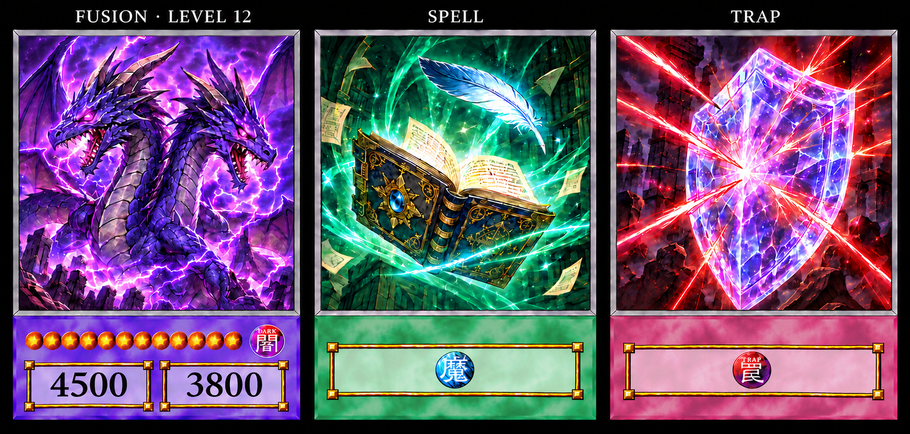

# Director-approved card design — 2026-09-13

The director approved `approved-final-layout.png` and explicitly requested that
these generated artworks be committed so future changes can be checked against
them. This is the visual authority for the front frames, replacing PR #73's
initial reference-crop approach. The exact runtime geometry is layout revision 5.

- `approved-final-layout.png`: final authority. Lowered monster number plates;
  stars and attribute share a center line. Larger upright numbers. Thin matched
  bevels, short colored panel, translucent gold-edged plates, muted cloud colors.
- `approved-muted-clouds.png`: preceding approved color/number-size study;
  final layout supersedes its monster vertical positions.
- `six-type-palette-study.png`: historical six-type color study only. Its panel
  height, bevels and spacing are superseded by the final image.

These images were generated with OpenAI's built-in image generation tool during
director review. They contain original example illustrations (dragon, spellbook,
crystal shield); they are design references, not delivered gameplay card art or
card definitions. Supplied third-party reference cards/sheets are NOT included.
Generated imagery was guided by the director's supplied anime-card references;
this provenance does not change the separately documented origins of badges.

## Reproduction and review

The final image-generation edit requested: move both monster number rectangles
and numbers down 12 image pixels; move the DARK attribute and all twelve stars
down 8 pixels together; preserve approved muted cloud texture, large upright
numbers, thin bevels, Spell/Trap layout and artwork. Generation is not pixel-exact:
use `assets/source/cards/frame-layout.json` revision 5 for implementation.

Runtime exports retain the established 590×860 resolution. The approved shortened
panel is represented by 230px (26.7%); do not silently revert to a taller panel or
force the earlier 25% proposal after the director approved the latest preview.
Borders and plates are reconstructed parametrically rather than cropped from
these sheets. `assets/source/cards/cloud-mottle.png` is a separate generated
texture, derived from the approved soft cloudy pigment appearance, then tinted
by type. Its prompt requested uniform grayscale diffuse cloud mottling, subdued
contrast, no borders, icons, text, veins, vignette or focal point.

Compare regenerated `docs/art/previews/cards30/card-set-review.png` to the final
reference for visual drift. Check all six types, level 12, margins, equal bevel
widths, centered Spell/Trap rectangles and larger upright stats. Attribute/star
and subtype icon source pixels stay approved and unchanged; imagegen's rendered
badges in the concept sheet must not replace those assets.
