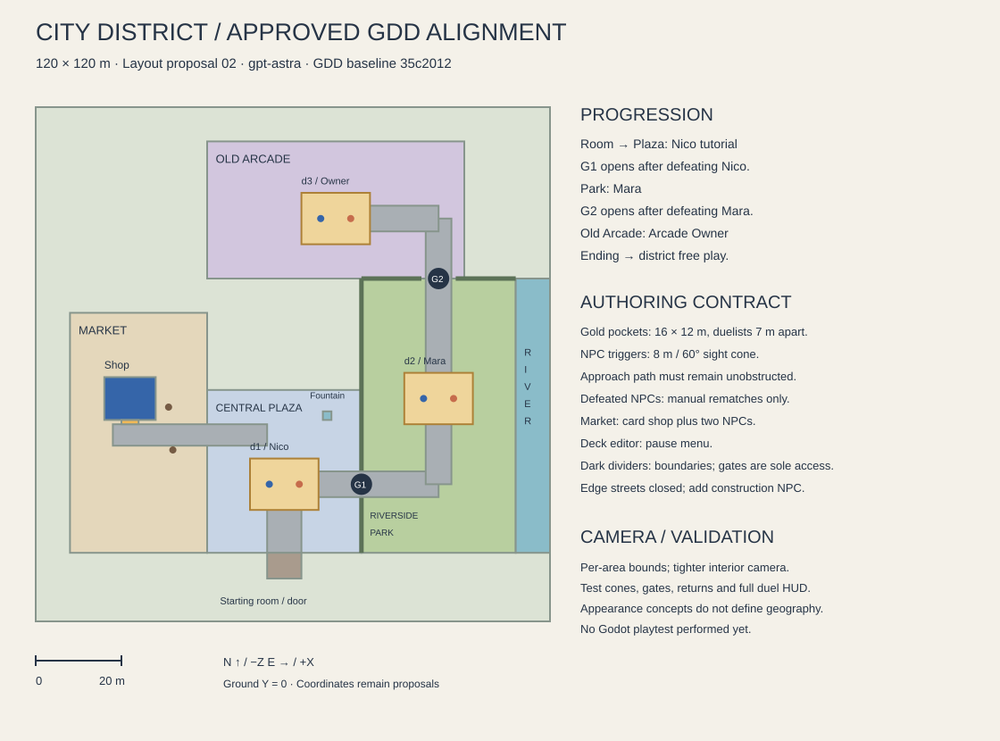

# City District — Level Proposal

**Author:** gpt-astra · **Updated:** 2026-09-07

**Status:** approved by the director (merged #12); aligned to the [GDD](gdd.md);
spatial dimensions below are blockout proposals, not engine-tested placements.

## Scope and route

Build one roughly **120 × 120 m** district as one Godot scene under
`levels/district/`, with per-area camera bounds. Include a starting room and
card-shop interior. The approved sequence is avatar creation → starting room →
Central Plaza / Nico → Riverside Park / Mara → Old Arcade / Arcade Owner →
ending with avatar and credits → district free play. Market Street supplies the
shop and two NPCs; it is not a mandatory stop before the tutorial duel.

X increases east; Z increases south; ground Y = 0. One unit = one metre.
The plan uses the GDD area IDs. Coordinates are proposed authoring data, not
an alternative schema. Duel pocket dimensions remain 16 × 12 m; increasing
the district size does not scale characters, doors or duel spacing.

| Area ID | Bounds X / Z (m) | Contents |
| --- | --- | --- |
| `plaza` | 40–76 / 66–104 | Spawn, fountain, benches, Nico (`d1`) |
| `market` | 8–40 / 48–104 | Blue-awning card shop, two NPCs, shop access from Plaza |
| `park` | 76–112 / 40–104 | Riverside path, Mara (`d2`), low planting and river boundary |
| `arcade` | 40–100 / 8–40 | Old Arcade façade/sign, Arcade Owner (`d3`) outside |
| `edge` | Outer boundary | Closed streets and construction-message NPC |

| Anchor | X,Z (m) | Requirement |
| --- | --- | --- |
| Starting-room exterior door | 58,104 | Leads into the Plaza; room size proposed 8 × 6 m |
| Plaza spawn | 58,98 | Safe arrival after room exit |
| Nico duel centre | 58,88 | 16 × 12 m clear street reservation |
| Fountain | 68,72 | Outside Nico's reserved camera/card space |
| Shop exterior centre | 22,68 | 12 × 10 m footprint; south door at 22,73 |
| Mara duel centre | 94,68 | 16 × 12 m reservation on the inland side of the river |
| Arcade Owner duel centre | 70,26 | 16 × 12 m reservation beneath the arcade sign |
| Plaza → Park connection | 76,88 | Opens after Nico's first defeat |
| Park → Arcade connection | 94,40 | Opens after Mara's first defeat |

Keep the west route from Plaza to Market open. Park access has one controlled
connection from the Plaza; the Arcade has one from the Park. Use continuous
hedges, façades and closed street boundaries elsewhere so a scenic shortcut
cannot bypass either progression gate. Return through opened connections to
reach the shop. No arcade interior or extra explorable area is implied.

The existing exploration and street-duel concepts remain **appearance studies**.
They do not define the whole district, the tutorial's location or progression.
The old 64 m plan, shop-first sequence and civic-square finale are superseded.

## Encounters, approach and camera space

Nico uses Beatdown, Mara uses Warrior Toolbox and the Arcade Owner uses Goat
Control. Their rewards, dialogue and AI remain defined by GDD §3.6. No changes
to those systems are proposed here.

Author an **8 m, 60° line-of-sight cone** for each undefeated, unlocked duelist.
Provide unobstructed approach space for exclamation → walk to player → dialogue
→ duel. The player can also interact to challenge. Locked duelists cannot be
challenged. After first victory disable automatic triggers, retain manual
rematches and use the GDD's smaller rewards. A loss returns the player to the
encounter spot without coin loss; verify it does not instantly retrigger while
the player is still in the cone. Trigger rearming belongs to Fable's systems.

For Nico, initially place the NPC near (58,91), looking south along the entry
route toward spawn (58,98), inside the 8 m range. Fable's arrival flow must
ensure the first Plaza entry reliably starts the tutorial after scene arrival.
Keep benches and fountain out of that cone and approach. For Mara and the Arcade
Owner, orient cones toward their unlocked approach paths; test the cone edges,
occlusion and approach endpoints in the greybox.

Use an east-west duel axis as the first staging experiment, with duelists
7 m apart. Reserve 3 m behind both duelists and lateral room for two rows of
five card zones per side. The 16 × 12 m pocket is an invisible clearance volume,
not a painted arena. Dynamic meeting positions and NPC approach can change
staging; validate the entire supported footprint with Fable's encounter tools,
not just the central pose. Stay in the overworld and use nearby valid street
positions under the agreed encounter implementation.

Overworld camera: fixed yaw, 55–60° pitch, 12–14 m distance and 0.15 s smoothing,
with bounds for each area. Interiors use a tighter distance. Compare framing
in engine before proposing any departure from these approved starting values.
For duel transitions, test both characters, all card zones, bottom hand UI,
top-edge chain stack, life counters, phase bar and modal/inspector overlays.

## Interiors and navigation

The starting room establishes the New Game arrival before the Plaza. A bed may
be decorative/interactable as Fable specifies, but adds no heal or save mechanic;
life resets per duel. Keep its exit obvious. The shop interior is proposed at
10 × 8 m, with a visible counter opening the card-shop UI. Deck editing is
available through the **pause menu**, not a dedicated physical station.

Use roughly 2 m doorways and at least 2 m clear aisles. Fade between exterior
and interior and return to the same door at a safe landing. Check tighter
interior camera framing and roof/front-wall visibility. Market's two NPCs and
its counter must not block the door. Place the district-edge NPC on a visible
closed street outside required traversal.

Walk speed is 2.2 m/s, run speed 4.5 m/s, and the player capsule is radius 0.35 m,
height 1.7 m. Test actual travel time and collision with those GDD values.
Keep all required routes at least 2 m clear, widen turns and encounters, and
use simple kerb/planting collision. No jumping or platforming is required.
Use stone and grass for the required footstep surfaces; assign other surface
variants only if the final kit uses them. River edges need readable physical
boundaries and must not create an accidental route around the Park gate.

## Build and acceptance

1. Greybox the 120 m district with five area IDs, both interior transitions,
   camera-bound volumes, three encounter reservations and two progression gates.
2. Test New Game → room → Plaza tutorial, including Nico's cone and approach.
   Verify Park and Arcade cannot be accessed/challenged before their unlocks.
3. Walk/run required routes using keyboard and gamepad; inspect occlusion,
   doorway return positions and camera bounds, including every district edge.
4. Test cone limits, obstructed sightlines, manual challenges, losses and rematches.
   Verify post-victory auto-trigger suppression and safe return from each duel.
5. Test complete card fields and HUD through every camera transition. Then add
   modular façades, fountain, benches, river/planting, arcade sign and audio.
6. Complete Nico → Mara → Arcade Owner → ending → free play; revisit the shop
   after each unlock. Confirm autosave/restore positions across area changes
   through Fable's save system. Validate profiling budgets before dense dressing.

No in-engine validation has been performed. Movement, triggers/approach,
progression gates, camera bounds, card-field/HUD, room/shop transitions and
save/return behaviour depend on Fable's reusable tools. See the
[technical handoff](../requests/art-direction-review.md).
