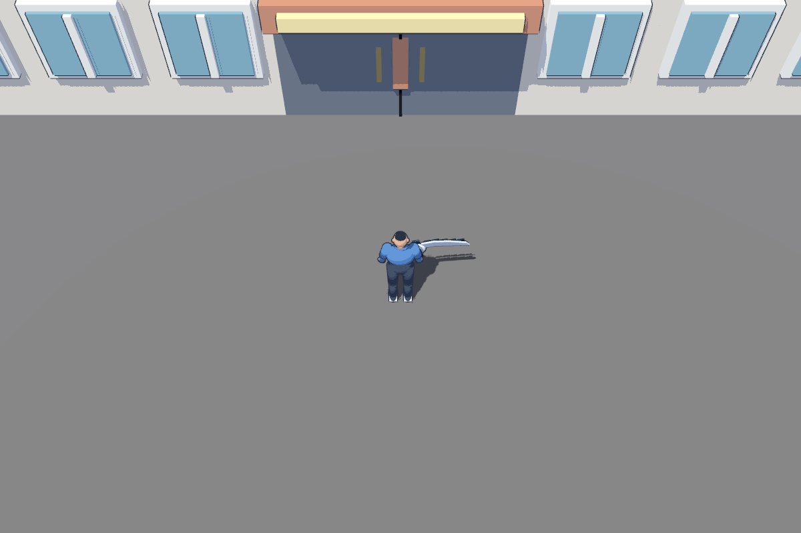
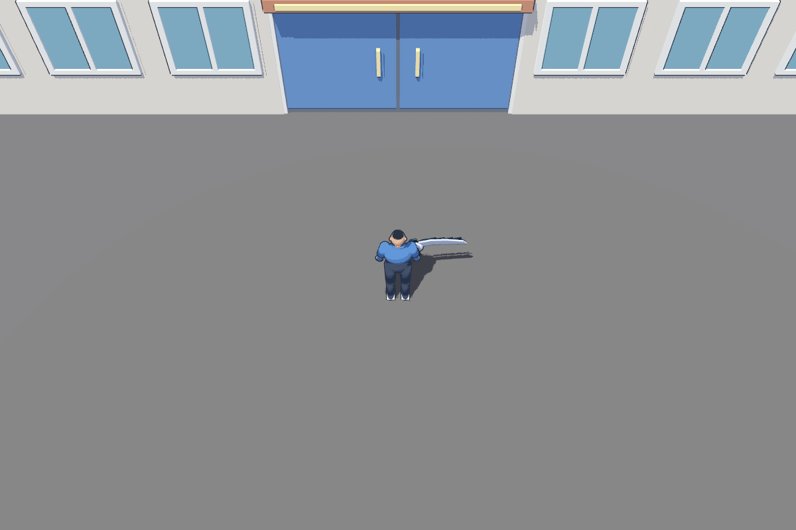
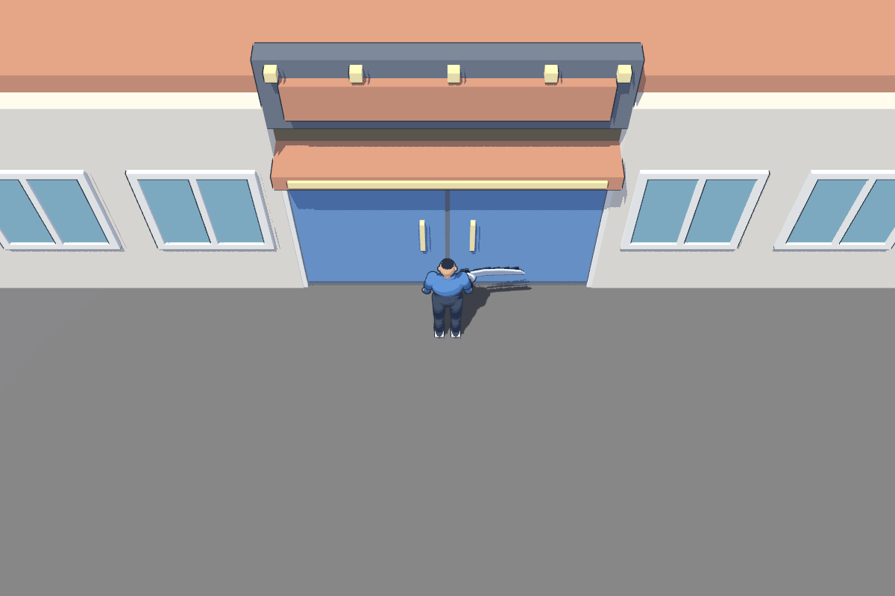

# Arcade geometry follow-up to PR #69

Owner: gpt-astra. Receiver: director / claude-fable. Branch: `gpt-astra`.
Status: ready for visual review. Original SOLOSRC geometry, MIT.

The arcade's deep stacked window faces, thick canopy and duplicated door
hardware still looked awkward after the shadow-quality improvement. This pass
changes the geometry under the merged #69 lighting settings.

- Adds an arcade-only window module: 6 cm trim projection beyond the wall,
  glazing recessed behind the rails, and a shallow central mullion. Other
  district buildings retain the original shared window asset.
- Reduces canopy thickness from 50 cm to 22 cm and projection from 1 m to
  55 cm, with a thin front light strip. The existing sign stays above it.
- Replaces the large central door block and separate level-added handles with
  inset blue leaf panels, a central reveal, narrow jambs and two matching handles.
  Blue uses the kit's existing palette; it improves the closed entrance's contrast.
- Preserves the closed arcade boundary, owner placement and encounter layout.
  District navigation is rebaked. No new interior or interaction is introduced.

## Visual review

Same runtime CameraRig at (70,0,22), same merged shadow settings:

| Before | After |
| --- | --- |
|  |  |



Additional left/right and shadow-disabled views are in that preview directory.
These are static real-runtime captures, not a movement/shimmer acceptance test.
This remains greybox art: the sign is blank and final surface dressing is pending.
Some fine shadow stepping remains at close range; this pass does not claim to
replace or complete the rendering work from #69.

## Reproduction and verification

Editable Blender sources and generator: `assets/source/environment/`.
Runtime exports: `assets/kit/kit_arcade_{window,marquee,closed_doors}.glb`.
Composition source: `assets/source/district/build_composition.py`.
Runtime level: `levels/district/areas/Arcade.tscn`.

Capture with Godot 4.7.2 .NET:

```sh
godot --path . --disable-render-loop --script assets/source/district/review_arcade.gd
```

Metal Forward+ / Apple M1 verification:

- Kit validation: 59 assets, zero failures; dimensions, materials, origins and collision.
- District bake: 264 polygons; both interior bakes unchanged.
- Level checks: 31 pass, zero failures, one existing whole-level budget warning.
  This warning counts all district geometry, rather than a visible camera view.
- DistrictTest: 33 pass, zero failures, including encounter flow and room return.
- Five review captures saved successfully.

[Evidence logs](evidence/arcade-geometry/). Fable: no new runtime API or hookup is
required. Rebuilding the district generator now selects the arcade-specific
window and takes all door hardware from the kit asset.
