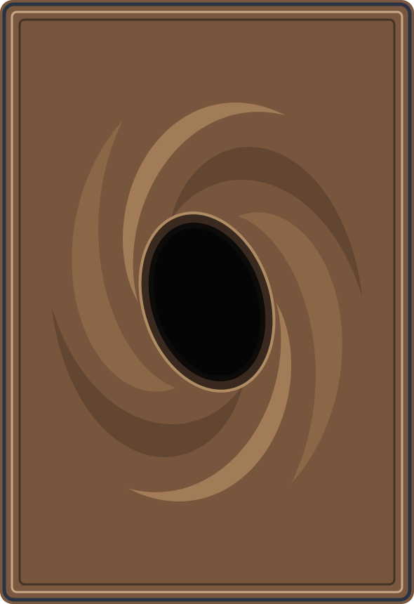

# Card back: flat brown black hole

Owner: gpt-astra. Status: ready for director review in a new PR after #39.

The director requested a predominantly brown black-hole back that fits the card
faces more closely. During iteration the director explicitly removed cloud-like
shading. This delivery therefore uses flat brown/cocoa/tan shapes around a
near-black elliptical centre, with the same restrained border language as the
fronts. No glow, cloud texture or gradients are present in the back.

Runtime path remains `assets/cards/frames/card_back.png` (590×860). Editable
source and builder remain under `assets/source/cards/`. Fable needs no code,
UV, layout or import-path changes. All front frames and icons are unchanged.

The complete set preview is refreshed for comparison with the approved faces.
Checks: all 22 texture exports passed dimension/transparency checks, the back
passed rotational-symmetry validation, and the rendered artwork was inspected.
Original SOLOSRC vector artwork under the repository MIT license.
