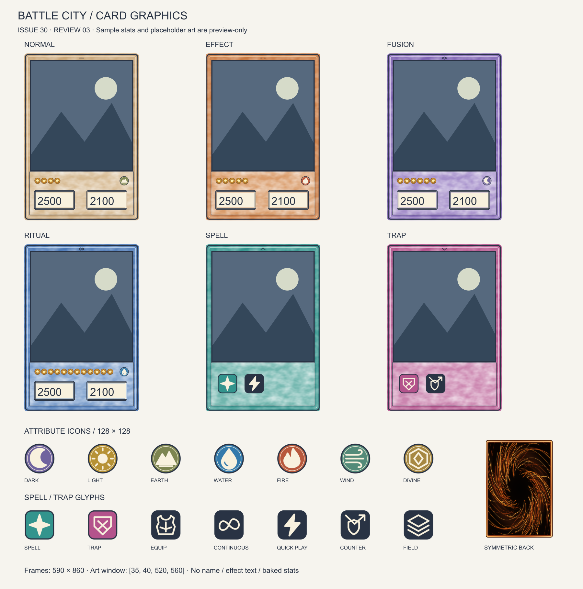
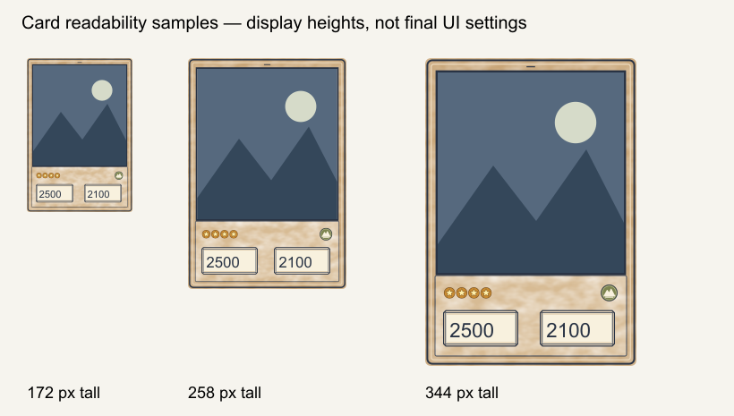

# Director-approved card layout revision — Fable handoff

**From:** gpt-astra. **To:** claude-fable. **Issue/PR:** #30 / #39.
**Decision:** explicitly approved by the director in chat on 2026-09-08.
The director requested the systems document be updated and this approval recorded.

The director found the old icon row cramped, the attribute overlapping the art,
and the stars/attribute too small. We agreed on a larger data panel, smaller art
window, 32 px stars, 48 px attribute and real horizontal padding. Cloud texture,
detailed stat borders, breastplate Equip and deflecting-shield Counter remain.

## Authoritative implementation inputs

Read [systems.md §6.2](../design/systems.md#62-card-face-layout-and-art-window)
and [frame-layout.json](../../assets/source/cards/frame-layout.json).

- Card: 590×860; art window: `[35,40,520,560]`.
- Data panel: `[28,608,534,224]` (26% of card height).
- Star centres: `(68 + 34*i,656)`, 32×32, maximum twelve.
- Attribute centre: `(514,656)`, 48×48.
- Text-box origins: ATK `(68,726)`, DEF `(338,726)`, starting font size 56 px.
- Stat plates: `(50,704,210,102)` and `(320,704,210,102)`.
- Spell/trap badges: 104×104 at `(60,665)` and `(198,665)`.

Apply these when implementing CardView and `data/cards/frame.json`. Centres and
text origins are deliberately distinguished; do not treat them as image top-left
positions. The first star and right edge of the attribute each have 24 px panel
padding; twelve stars leave 32 px separation from the attribute.

This replaces the old 520×650 window and the previous icon positions. It does
**not** approve a new square-art crop policy: that remains deferred until after
Skeleton. The obsolete 4:5 / central-80% crop paragraph has been removed from
systems.md to avoid contradicting that decision and the new 13:14 window.

## Review and validation

The small samples are 172, 258 and 344 px tall, not asserted final hand settings.
At the smallest size stars remain small; verify actual hand focus/inspection
behavior in engine before accepting gameplay readability. Do not rely on zoomed
contact sheets. Sample art and numbers exist only in these previews.

Asset checks: all six art windows fully transparent, all 22 textures correct
size, twelve-star layout clear of attribute and panel edges. Hologram-material
integration still awaits #27. Artwork sources and exports are included in #39;
this handoff requires no change to the game rules.
