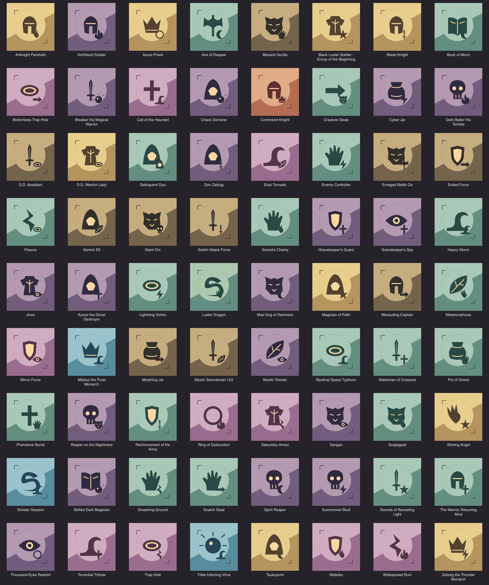
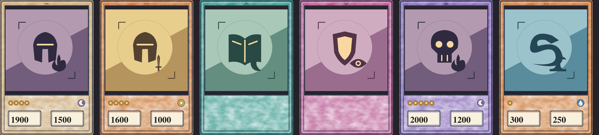

# 72-card placeholder art delivery

Owner: gpt-astra. Receiver: claude-fable. Status: director review pending.
Asset-list §4.2, based on main including the merged data roster in PR #48 and
animation delivery in PR #49. Branch: `gpt-astra`.

[Searchable local review page](../art/previews/card-placeholders/index.html).
Open from a repository checkout; GitHub displays HTML source rather than running
it. The page includes contain/cover comparisons for review only.

## Delivered assets

- 72 opaque 512×512 PNGs: `assets/cards/art/<card_id>.png`, exactly matching the
  merged `data/cards` roster, with committed Godot import presets.
- 72 editable original SVG sources plus builder, exporter, inventory and
  validation under `assets/source/cards/placeholders/`.
- Every card has a distinct primary/secondary motif pair. Attribute and card-kind
  palettes, simple silhouettes and generous edge space support small displays.
- All new shapes are original SOLOSRC work, MIT. No third-party card illustrations
  or copied character designs. Card names label the review page only.

This fulfills the symbolic placeholder pass, not final illustrations (§4.3).
Related cards deliberately share large motifs; the secondary motif distinguishes
members of a family. Names and inspection UI should remain available while
playtesting. The icon-like silhouettes do not promise final character designs.

## Fable handoff

Load art using `res://assets/cards/art/<id>.png`. No JSON schema or card rules
changed. The existing frames, back, stars and attributes are unchanged. This
asset delivery does not implement CardView, texture lookup or the hologram shader.

The runtime crop decision remains deferred under systems §6.2. Review composites
contain the square in the approved 520×560 art window at (35,40); cover is an
optional HTML comparison. Neither is a new director-approved crop contract.
The samples retain the approved data-panel margins and display monster stars,
attributes and numbers. Spell/trap badges are omitted from this art-only review.

Integrate these textures when CardView lands, then check actual hand-size,
selection and hologram readability. Keep #30 open until the shader acceptance
work is complete. No existing dependency issue is closed by this delivery.

## Validation

- Exact 72-ID match against card JSON; 72 opaque 512×512 PNGs with distinct decoded
  pixel hashes. Export report: `assets/source/cards/placeholders/validation.json`.
- Godot: all 72 Texture2D resources load at the correct size and bind to
  StandardMaterial3D. This is not hologram shader acceptance.
- Card-data validation: 1,934 checks, zero failures.
- Visual review: full inventory at 128px art size and six framed samples at
  177×258; no subject cropping with the review's contain fit.
- All local HTML image/export links resolve. Interactive browser testing was
  unavailable: browser security policy blocked opening the local file URL.
  Search and fit controls therefore remain unverified in-browser.

Evidence is under [evidence/card-placeholders](evidence/card-placeholders).
Rebuild instructions: [source README](../../assets/source/cards/placeholders/README.md).
