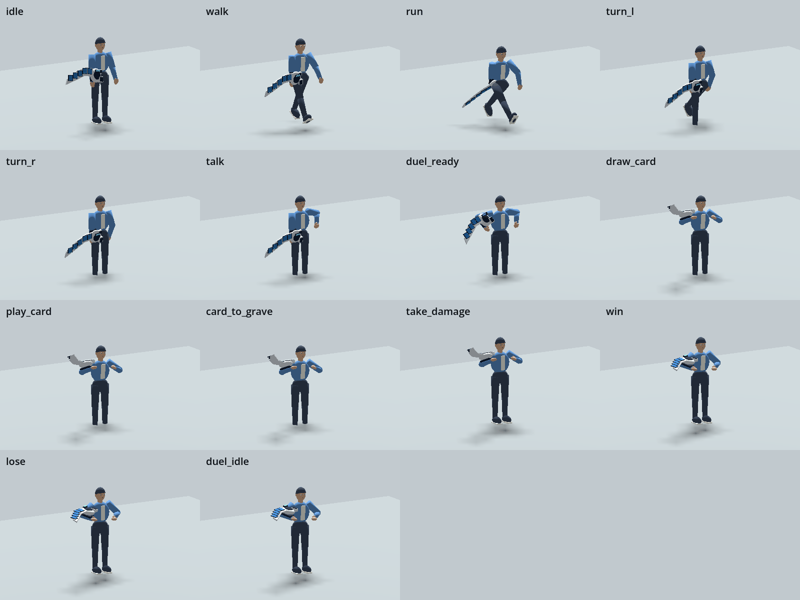

# Character animation set — motion blockout

Owner: gpt-astra. Receiver: claude-fable. Status: director review pending.
Delivered on `gpt-astra`, based on main including PR #47. This covers the 14
clips in asset-list §2.9 without requiring the pending shader or card-data work.

[Static contact sheet](../art/previews/animations/contact-sheet.png).
The preview uses the existing technical body/disk, rendered through the actual
Godot Character scene. The short gestures repeat with a half-second hold for
review. This is motion blocking, not approval of final character art.

## Delivery

Runtime: `assets/characters/anims/character_anims.glb` and its loop import preset.
Editable source and rebuild instructions:
[`assets/source/characters/animations`](../../assets/source/characters/animations/README.md).
All new motion is original SOLOSRC work under MIT. No third-party motion data.
The existing rig, skin, body export and shared gameplay code are unchanged.

| Clip | Seconds | Loop | Event seconds |
| --- | --- | --- | --- |
| idle | 4 | yes | — |
| walk | 1 | yes | footstep_l 0, footstep_r 0.5 |
| run | 0.7 | yes | footstep_l 0, footstep_r 0.35 |
| turn_l / turn_r | 0.3 each | no | — |
| talk | 3 | yes | — |
| duel_ready | 1.2 | no | disk_deploy 0.5 |
| draw_card | 0.8 | no | card_draw 0.4 |
| play_card | 0.9 | no | card_release 0.5 |
| card_to_grave | 0.6 | no | card_to_grave 0.3 |
| take_damage | 0.7 | no | hit 0.1 |
| win / lose | 2.5 each | no | — |
| duel_idle | 4 | yes | — |

All clips are sampled at 30 fps with fixed Root. Locomotion uses opposing arm
and leg swings, sole-height correction and a small run flight arc. Duel gestures
keep the disk arm raised; the free hand reaches toward the disk for draw/grave,
and extends forward for play. The reaction and celebration have distinct poses.

## Fable handoff

The existing Character loader retargets these clips and injects the existing
JSON event times; all twelve required clips now resolve without fallback aliases.
The event numbers have not changed. `turn_l` and `turn_r` are additionally
available in the library, but the current AnimationTree does not reference them.
They supply a small anticipatory step/twist; the controller still owns world yaw.
Wire them when the turn-state design calls for them. Gameplay sequencing and
held-card/VFX responses to events remain Fable's responsibility.

Rebuilding the legacy smoke asset generator overwrites the animation carrier;
run this full-set builder afterward. Keep the carrier's import preset with its
GLB so the five looping clips retain their intended behavior.

## Validation

- Animation verifier: all 14 clips, lengths and loop flags, authored bone motion,
  fixed Root translation/rotation/scale, five closed loops, finite sampled poses
  and all nine injected event keys; zero failures.
- CharacterTest: 6 pass, 0 fail; expected 9.30 m movement, active skeleton,
  mounted disk and emitted footstep/deploy events; no clip aliases.
- SmokeTest: 23 pass, 0 warn, 0 fail, 0 skipped.
- DistrictTest: 33 pass, 0 fail, including tutorial encounter and room return.
- .NET build: 0 warnings, 0 errors. Godot import completed.
- Godot rendered a 60-frame contact-sheet sequence for visual review.

Logs are under [evidence/character-animations](evidence/character-animations).
These automated scene checks do not establish physical gamepad acceptance or
final shader/art approval.

## Remaining art work

Director motion review and polish remain. This set uses the smoke body's
integrated outfit and simple hands; modular male/female bodies, finger grips,
held-card geometry and facial animation are not delivered here. Fine hand-to-slot
contact needs final body/disk dimensions. Locomotion is in-place blocking with
sole-height correction, not a production foot-lock/IK pass; foot sliding and
transitions need another review with final proportions. This delivery does not
close the pending shader, controller acceptance or environment-art issues.
