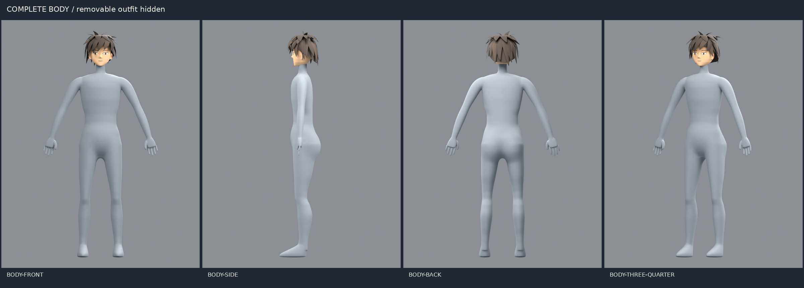
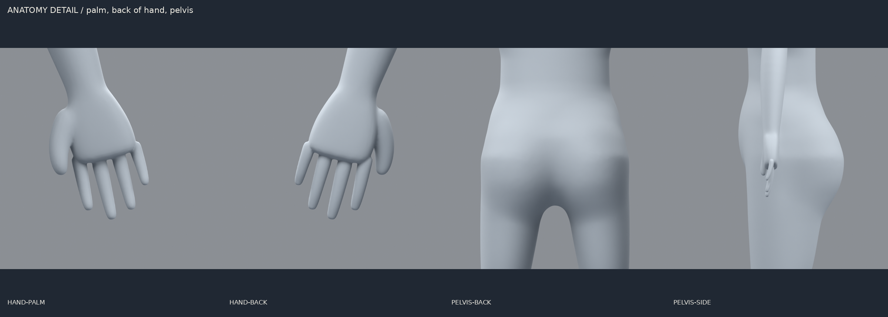

# Character A complete-body revision — #99

Owner: gpt-astra → director. Status: revised proposal, awaiting review.
Branch: `astra/99-character-base`. PR: https://github.com/SoloSrc/battle-city/pull/215

The first dressed-shell proposal was rejected. This correction adds a complete
underlying body and addresses the reported hands, leg alignment, pelvis, ears
and nose. Hair is retained.

Start with these unclothed clay views, then inspect the
[dressed/reference comparison](evidence/character99/comparison.png) and
[head detail](evidence/character99/head.png).

The Blender file has separate `01_BODY_complete`, `02_HAIR_removable` and
`03_OUTFIT_removable` collections. The body persists under every garment.
`character_a_body_only.glb` is a second export for direct inspection. The Godot
check compares body mesh arrays between dressed/body-only exports; hiding the
outfit must not alter the body. Geometry, counts and import results are recorded
beside the source.

The body topology check requires one connected torso/limbs/hands/feet mesh with
no boundary or non-manifold edges. The head is separately interchangeable;
its nose and ears belong to the head surface. New clothing can be fitted over
this complete body. It is still unrigged: shared skin weights and in-game outfit
swapping are not delivered by #99.

[Source, wardrobe instructions and reproduction](../../assets/source/benchmark-character99/README.md).
The measured revision time and exact changes are in
[revision notes](../../assets/source/benchmark-character99/revision-notes.md).

#99 remains open until the director approves the base. #100 handles production
retopology/UVs, #101/#105 textures and anime shading, #102 rigging. These images
are a base-model review, not final production fidelity or #110 acceptance.

Fable: no shared code change or integration requested. The review exports stay
separate from the playable character. Both source and new geometry are SOLOSRC
original, MIT, with no third-party base mesh or generator.
