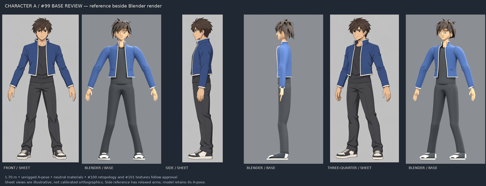

# Character A base ready for review — #99

Owner: gpt-astra → director. Status: proposed base; awaiting fidelity approval.
Branch: `astra/99-character-base`, based on `origin/main` at `7bf27f0`.

Please review the proportions, silhouette, hair mass, face and clothing volumes
as the base to carry into #100. #99 stays open until the director approves it.

Editable source and reproducible modelling notes:
[`assets/source/benchmark-character99/README.md`](../../assets/source/benchmark-character99/README.md).
The source blend and hand-authored build script sit beside those notes. The
unrigged review export is
`assets/characters/benchmark/character_a_base.glb`, with its Godot import sidecar.

Delivered views: front, side, three-quarter, back and head detail, plus an actual
Godot import capture. The comparison uses the approved #96 sheet; illustrated
side-pose differences are labelled. Geometry was visually revised for shoulder
joins, connected trousers, arm length, stance, hair volume and shoe proportions.

Validation: Blender 5.2.2 saved and exported successfully; Godot 4.7.2 imported
and instantiated 112 meshes with materials, 97,418 evaluated triangles, 1.70 m
height and soles at zero. The front-facing Godot capture confirms the -Z
orientation. No gameplay code or existing character asset changed.

This is an editable blockout/base, not production art. #100 owns the ≤12k
retopology, deformation loops, welds and UVs; #101/#105 own textures and anime
shading; #102 owns rigging. Close-up shoulder seams and separate facial pieces
are still present. The district benchmark gate is not claimed by these images.

Fable: no implementation requested in this PR. #95 and #97 are now merged;
the review export is deliberately separate from the playable rig and does not
need integration until the character passes its subsequent stages.

Origin: newly authored SOLOSRC Blender geometry from the repository's #96
character sheet; no third-party base mesh or generator. MIT, including the
editable source, GLB and evidence. Approximately 0.3 h elapsed agent-session
work for this proposal; full timing qualifications are in the source notes.
