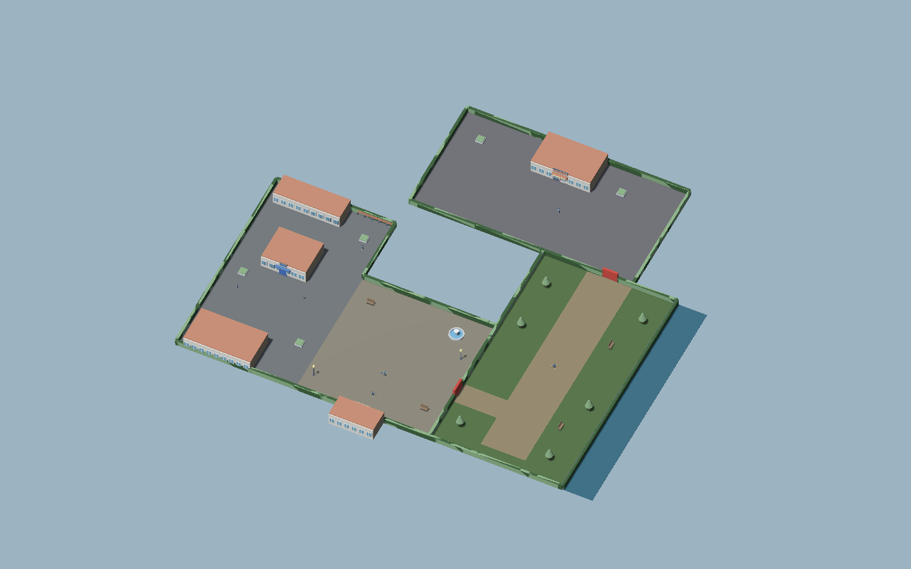

# District composition — #31 handoff

**Owner:** gpt-astra · **Recipient:** claude-fable · **Date:** 2026-09-09

**Status:** scene composition ready for director review on `gpt-astra`.
Issue #31 stays open: New Game → starting room → Nico tutorial requires #23,
and a physical gamepad walkthrough remains outstanding. No physical joypads
were reported by Godot during this audit. The automated movement checks inject
analog joypad events into Fable's existing controller.



## Delivered composition

- Five zero-transform area sub-scenes in `levels/district/areas/`: Plaza,
  Market, Park, Arcade and Edge. All placement uses the approved world axes
  and metre coordinates. Each has a CameraBounds and an AmbientZone carrying
  `metadata/area_id`. Edge's volume is the closed construction street; it does
  not overlap the entire district or defeat the other camera bounds.
- Nico, Mara and Arcade Owner use Fable's Duelist scene and IDs `d1`–`d3`,
  8 m / 60° cones and separate 16×12 m, east-west EncounterSites. Stand spacing
  remains 7 m. Nico faces the arrival; Mara and Arcade Owner start with both
  `Armed` and `Challengeable` false until runtime progression unlocks them.
- Park gate at (76,88), `defeated:d1`; Arcade gate at (94,40), `defeated:d2`.
  Continuous boundaries close alternate entries; Market remains reachable.
- StartingRoom (8×6 m) and CardShop (10×8 m) with 2 m exits, return spawns,
  wood SurfaceTag floors and a reachable ShopCounter. Exterior floor tags
  distinguish stone and grass. Interior south walls are low and roofs omitted
  to preserve the fixed-yaw camera view; exterior buildings are solid massing.
- Approved #32 kit instances at unit scale supply walls, roofs, signs, props
  and boundaries. Large simple floor colliders keep the greybox manageable.
  Decoration, named-character art, sign lettering, music/ambience and final
  toon materials are not part of this skeleton delivery. Audio IDs remain empty.

The starting-room building anchor remains (58,104). Its interaction plane sits
0.3 m in front of the façade, behind a 2 m gap in the south hedge. The card-shop
plane sits 0.5 m in front of its south wall. These are interaction offsets;
neither changes the approved building footprint or route.

## Integrating with #23

`levels/review/DistrictComposition.tscn` is an artist review assembly, not the
runtime District root. It contains one NavigationRegion3D, one environment,
one sun, the five areas, a Player and CameraRig. Run it directly to inspect
movement; door, encounter and shop signals intentionally have no flow handlers.

1. Instance the five areas under the runtime District's single NavigationRegion3D,
   with all area/root transforms left at identity. Reuse the provided navigation
   resource or rebake after changing geometry. Do not nest the entire review
   assembly inside the runtime scene and duplicate its player/camera/environment.
2. Replace the two interior Exit `TargetScene` values with the actual runtime
   District path when it exists. They currently reference the review assembly
   so every authored door target and spawn is a real, checkable resource.
   Their target spawns are `room_return` and `shop_return`; each interior has
   `arrival` and `exit_return`. Exterior arrival is (58,0,98), room return
   (58,0,101), shop return (22,0,76).
3. Use the existing signal contracts: Door.TransitionRequested,
   ShopCounter.ShopRequested, Duelist.PlayerSpotted/Challenged and TalkNpc.
   Apply saved flags to gates and update both duelist lock properties. The
   spatial audit calls Gate.Open directly to isolate geometry; it does not
   certify save flags, victories, loss recovery, rematches or trigger rearming.
4. Resolve provisional talk IDs `market_resident`, `card_collector`,
   `district_edge` against your dialogue data. Area metadata identifies the
   volumes for integration; it is not a new engine schema or save implementation.
5. Complete arrival ownership, scene fades, save/return positions, tutorial,
   encounter approach/occlusion, duel camera/HUD and full progression. Then run
   the checklist on the actual District and repeat the physical gamepad route.

No shared gameplay code or project settings were modified. All scripts in
`assets/source/district/` are artist-side builders, audit or capture entry points;
none is attached to a level node. The Python builder regenerates authored scenes
and resets navigation resources, so always rebake afterwards. Before runtime
integration edits, either update the builder or retire it explicitly to avoid
overwriting Fable's changed door targets and wiring.

## Validation

Godot 4.7.2 .NET on Apple M1. Game project build: zero warnings/errors. An initial
solution-wide `--no-restore` build stopped at missing NuGet assets for the unrelated
Duel.Core.Tests project; the successful validation targeted BattleCity.csproj.

| Check | Result |
| --- | --- |
| Fable checklist: district review assembly | 26 pass, 0 fail, 2 warn |
| Fable checklist: StartingRoom | 9 pass, 0 fail, 0 warn |
| Fable checklist: CardShop | 9 pass, 0 fail, 0 warn |
| World-collision clearance | All three 16×12 m reservations clear |
| Navigation | Arrival connects to shop and both later encounters; all retained vertices in camera bounds |
| Locked-route sampling | 1 m grid with swept player capsules: neither later area accessible; first gate grants Park only; both grant Arcade |
| Movement | Walk/run outbound routes and full Arcade→shop return pass through PlayerController |
| Interaction | Four doors emit TransitionRequested; counter emits ShopRequested through player interaction |
| Nico cone | Arrival inside; point beyond 8 m rejected |

Navigation is baked from world-layer static colliders. Gates are excluded only
during baking, then their collision is restored; paths anticipate future unlocks,
while physical barriers enforce the current state. Full-height collision is
baked before elevated roof/prop polygons are removed. Radius 0.5 m / height
1.75 m conservatively cover the 0.35 m / 1.7 m player on the project's 0.25 m
voxel grid. Retained navigation sits 0.5 m above the floor after rasterization,
within the checker tolerance; actual movement uses the real floor collision.

The checklist warnings are (1) `data/duelists.json` pending #26 and (2) the
whole-level mesh surface estimate exceeding a *per-view* budget: 70,260 triangles,
712 surfaces. Actual Compatibility-renderer gameplay samples at 1600×1000:

| View | Visible draw calls |
| --- | ---: |
| Nico | 32 |
| Market / shop exterior | 143 |
| Edge | 99 |
| Park | 37 |
| Arcade | 61 |
| Starting room | 33 |
| Shop interior | 63 |

The zoomed-out authoring overview reports 2,077 draw calls; it is not a gameplay
camera. Shadow range is 25 m for the close exploration view. These snapshots are
not an exhaustive FPS benchmark, nor Forward+ or final-shader certification.
Reprofile after runtime and art integration, including the duel view.

### Measured movement times

Simulated seconds at fixed 60 Hz, including acceleration and waypoint turns;
no dialogue, fades, menus or duels. Partial analog input selects 2.2 m/s walk,
full input selects 4.5 m/s run. Exact waypoints live in the audit script.

| Route | Walk | Run |
| --- | ---: | ---: |
| Arrival → Nico approach (5 m) | 2.25 s | 1.15 s |
| Plaza → shop | 23.32 s | 11.52 s |
| Nico area → Mara approach | 22.30 s | 11.03 s |
| Mara area → Arcade approach | 30.30 s | 15.13 s |
| Arcade → shop via both gates | 75.27 s | 37.13 s |

The long shop return is visible in this first measured layout. Keep it as a
director playtest question after #23 is integrated; no shortcut or progression
change has been introduced without approval.

### Framing and remaining acceptance

The exploration rig retains 57° pitch, 12 m distance, 35° FOV and 0.15 s smoothing.
The close encounter screenshots show character readability but little surrounding
dressing, as expected inside an unobstructed pocket. This camera does **not**
frame the full 16×12 m reservation: Fable's duel camera and complete HUD/card
layout must be validated together. Interior bounds use 57° / 7 m / 35°.
No roof obscures interiors; the low south walls retain exit visibility when
the camera follows the player toward the door.

Not yet tested: New Game tutorial, physical controller feel, every camera seam,
NPC approach with occlusion, manual challenge/lose/rematch flows, autosave/restore,
ending/free-play, complete duel UI and production shading. #31 remains open for
these integrated acceptance checks. #32's kit is now placed and structurally
checked in the review assembly; its final runtime District acceptance remains
pending #23 as well.

## Reproduce

From the repository root (use your local Godot .NET binary for `godot`):

```sh
python3 assets/source/district/build_composition.py
dotnet build BattleCity.csproj
godot --headless --editor --import
godot --headless --script assets/source/district/bake_navigation.gd
godot --headless -s tools/level_check.gd -- res://levels/review/DistrictComposition.tscn
godot --headless -s tools/level_check.gd -- res://levels/district/interiors/StartingRoom.tscn
godot --headless -s tools/level_check.gd -- res://levels/district/interiors/CardShop.tscn
godot --headless --fixed-fps 60 --script assets/source/district/verify_composition.gd
godot --rendering-method gl_compatibility --script assets/source/district/render_composition.gd
```

Raw check, movement, bake and render logs are in `docs/requests/evidence/district31/`.
The [preview folder](../art/previews/district/) contains actual Godot captures.
