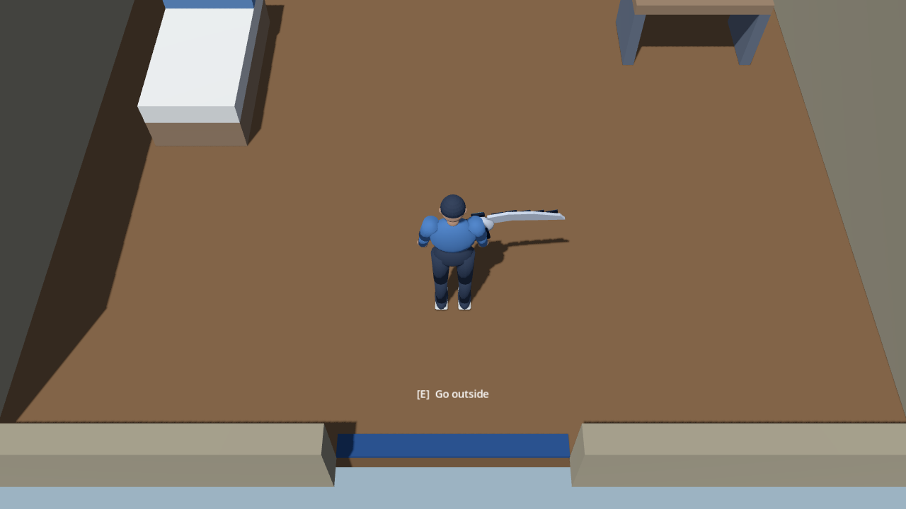
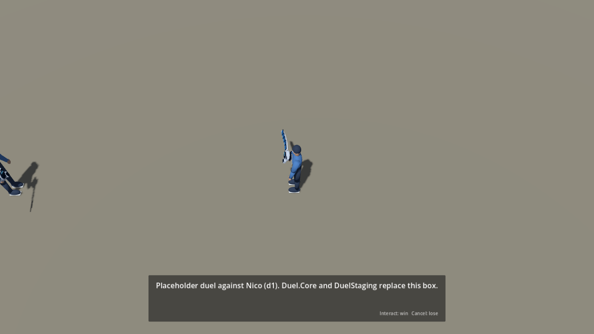

# District runtime integration — #31 / #32

Latest: [artist shader review](shader-art-review.md) completes the visual review
and proposes material/daylight tuning. Earlier pending-shader notes below are historical.


**Owner:** gpt-astra · **Recipient:** claude-fable / director · **Date:** 2026-09-13

The approved #44 area composition now runs through the Game flow delivered in
#45. This supersedes the pending-#23 integration steps in
[district-composition31.md](district-composition31.md). Submitted on `gpt-astra`
for director review; shared C# code and project settings are unchanged.

## Scene contract

| Runtime resource | Purpose |
| --- | --- |
| `levels/district/District.tscn` | Five area instances, one NavigationRegion3D, environment and sun |
| `levels/district/interiors/StartRoom.tscn` | Integrated 8×6 m starting room |
| `levels/district/interiors/ShopInterior.tscn` | Integrated 10×8 m shop |
| `levels/district/navigation/District.tres` | Baked district navigation shared with the review assembly |

Game creates and carries the sole player and CameraRig. The runtime level does
not instance either one. `levels/review/DistrictComposition.tscn` remains a
standalone artist inspection assembly; use Boot for the playable flow.
The duplicate review interiors `StartingRoom.tscn` and `CardShop.tscn` are removed.
Builders, capture and audit scripts now use the canonical runtime paths.

Doors preserve Fable's spawn contract: New Game uses room `arrival`; exterior
doors enter interiors at `door`; the room returns to district `arrival` (58,98),
and the shop returns to `shop_door` (22,76). Both interior exits use “Go outside”.
The full-height interior door placeholder is hidden in favour of a low blue
threshold so the fixed-yaw camera can see the player approaching the exit.

The three EncounterSite IDs are `nico`, `mara`, `arcade_owner`. Duelists retain
`d1`–`d3`, Fable's display/challenge text, and the approved 7 m stand spacing.
Mara uses `RequiredFlag = defeated:d1`; Arcade Owner uses `defeated:d2`.
They no longer have permanently disabled Armed/Challengeable switches, which
would prevent unlocking through Game.ApplyFlags. Gate flags remain identical.
Arcade Owner now faces southeast (225° yaw) toward the route from the Park gate;
the previous southwest-facing cone missed that approach.

The #44 geometry remains authoritative: Nico (58,91), Mara (94,71), Arcade Owner
(74,27), site centres (58,88), (94,68), (70,26). These NPC starting positions
differ from Fable's temporary geometry seed; the site IDs/centres and runtime
contracts are preserved. Four Sign markers, the existing talk IDs and area
music/ambience IDs are retained. IDs currently log or open placeholder dialogue;
no audio files, final NPC appearance or production UI are implied.

Navigation is committed baked from full-height world collision, with closed
gate blockers excluded during the bake and elevated surfaces removed. Game
already skips baking a populated mesh, so no engine change is required.
Rebuild after geometry edits: the source builder resets navigation resources.
Do not rely on the fallback runtime bake to reproduce the gate exclusions.

## Verification

Godot 4.7.2 .NET, Apple M1. Game C# project builds with zero warnings/errors.

| Check | Result |
| --- | --- |
| Fable's unchanged DistrictTest | 33 pass, 0 fail, 2,092 frames |
| District checklist | 28 pass, 0 fail, 2 warnings |
| Starting room / shop checklists | 9 pass each, 0 failures or warnings |
| Artist runtime route | 22 pass, 0 fail |
| Runtime route with actual rendered captures | Same route plus 10 captures: 32 pass, 0 fail |
| Existing spatial audit | 0 failures |

DistrictTest proves New Game → room exit → Nico arrival/cone → loss with safe
return and retrigger suppression → manual rematch/win → Park unlock → room return.
The additional runtime route wins the three **placeholder** duels in sequence,
walks through the actual gates, returns to the shop, invokes its placeholder UI,
exits at `shop_door` and verifies all flags and open gates survive the transition.
It neither calls Gate.Open nor grants flags directly. The return route passes
south of Nico's post-duel position instead of trying to walk through his capsule.

The checklist warnings are missing `data/duelists.json` (#26) and the whole-level
surface estimate (61,380 triangles / 710 surfaces) exceeding a per-view budget.
Gameplay inspection views remain below 600 draw calls; exact sampled counts are
in the render log. These are Compatibility-renderer snapshots, not full FPS or
Forward+ certification. Camera settings remain 57° / 12 m / 35° outdoors and
57° / 7 m / 35° indoors, with the 25 m shadow range from #44.





The second image confirms Fable's known framing limitation: at 7 m separation,
the opponent reaches the exploration camera's edge. The future duel camera and
full card/HUD layout must resolve this together; no camera decision is silently
changed here. Interior thresholds keep the exit readable without occluding the
avatar. Captures use the actual Game player, CameraRig, prompts and MessageBox.

## Remaining acceptance and handoff

- #31's runtime dependency is resolved and its automated tutorial path passes.
  Keep the issue open for the required **physical gamepad walkthrough** and
  director acceptance. Godot reported no connected physical joypads; injected
  stick/button events do not establish controller feel or every camera seam.
- #32's kit is placed and structurally checked in the actual runtime District.
  Its materials remain the approved greybox PBR placeholders pending #27's toon
  shader; do not represent this as final shader/style acceptance.
- Full card gameplay, rewards, autosave/reload, ending/free play and production
  dialogue/shop UI are outside the placeholder flow tested here. In-memory flags
  surviving an interior transition are not a save-system test.
- No additional integration work is needed from Fable to load these areas.
  Continue using the existing Paths constants and marker IDs. Future scene edits
  must also update or explicitly retire `build_composition.py` to remain reproducible.

## Reproduce

From the repository root with Godot .NET:

```sh
dotnet build BattleCity.csproj
python3 assets/source/district/build_composition.py
godot --headless --editor --import
godot --headless --script assets/source/district/bake_navigation.gd
godot --headless --fixed-fps 60 --quit-after 3600 res://tests/scenes/DistrictTest.tscn
godot --headless -s tools/level_check.gd -- res://levels/district/District.tscn
godot --headless -s tools/level_check.gd -- res://levels/district/interiors/StartRoom.tscn
godot --headless -s tools/level_check.gd -- res://levels/district/interiors/ShopInterior.tscn
godot --headless --fixed-fps 60 --script assets/source/district/verify_runtime.gd
godot --headless --fixed-fps 60 --script assets/source/district/verify_composition.gd
godot --rendering-method gl_compatibility --resolution 1280x720 --fixed-fps 60 --disable-render-loop --script assets/source/district/verify_runtime.gd -- --capture
```

`DistrictTest` needs the frame limit shown above; its finished diagnostic stays
open otherwise. The standalone artist audits exit themselves. Capture mode forces
draws only for the recorded screenshots. Logs are preserved in
`docs/requests/evidence/district-runtime/`; prior #44 logs remain historical.
