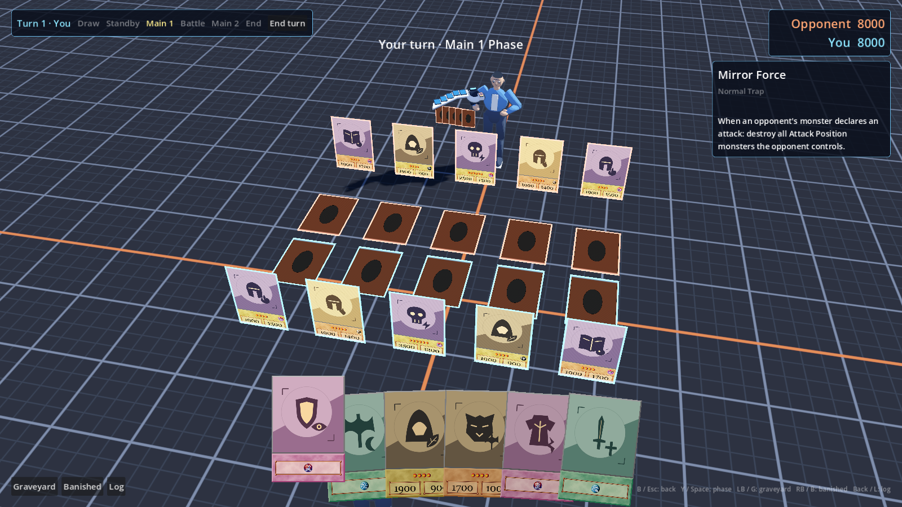

# Duel card sizes and raised camera

Owner: gpt-astra. Shared runtime handoff: claude-fable.
Status: implemented for director visual review.

The director requested smaller cards on the disk, larger field cards, a
modestly larger hand, and a raised camera from the player's right looking
down toward the field. This authorizes the focused shared-presentation edits.

- CardView now tweens a presentation scale with placement. Its collider and
  mesh inherit the same scale; RestTransform carries the target scale for VFX.
- DuelStaging chooses 3× field, 0.25× disk piles, 1.1× 3D hand; fallback piles
  without a disk remain at base size. Field columns are 0.92 m apart (enough
  for sideways defense cards); rows are 1.2 m apart, 1.8 m forward.
- Camera looks at the stand-point midpoint, 0.8 m high, from 9 m away,
  pitched 40° and yawed 12° to the player's right. CameraRig's blend API stays
  the same. Tuning JSON and fallback defaults agree.
- HUD hand is 156 px wide instead of 140; remains screen-space and pickable,
  with bottom margins. Card frame proportions and source artwork unchanged.

## Reproduce the screenshot

Build, then run Godot in this worktree:

```sh
dotnet build
Godot --path . tests/scenes/DuelLayoutPreview.tscn --resolution 1600x900 -- --capture /tmp/duel-layout-preview.png
```

The fixture uses production character/disk assets, card rendering, camera and
HUD. Both players have five face-up attack monsters and five Set Spell/Traps;
the engine state is deliberately staged rather than a legal move sequence.
The session is frozen. Generated art is forced for safe committed evidence.
Omit `--capture` to leave the scene open for manual picking and inspection.

Fable: review the size transition, effect transforms, field-zone placement and
camera interaction with real encounter surroundings. This addresses the camera
portion of #88; hit anchors and result-audio lifetime remain separate work.

## Validation

- .NET: 65 data tests + 359 engine tests passed; build has no warnings/errors.
- Godot staging: 57 passed; HUD: 24 passed. Orientation assertions normalize
  their vectors so size does not change their meaning.
- Rendered 1600×900: all twenty field-card centers are visible and ray-pick
  their matching cards, with the intended field scale (zero failures).
- Screenshot: [full field](evidence/duel-layout/full-field.png).



CI follow-up: verbose reproduction identified leaked WAV/playback resources in
headless shutdown, despite all staging assertions passing. DuelEffects now
loads and counts cues but starts audio only in windowed runs. A headless
assertion verifies players stay stopped; rendered game audio is unchanged.
