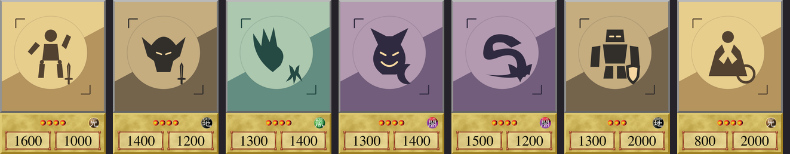
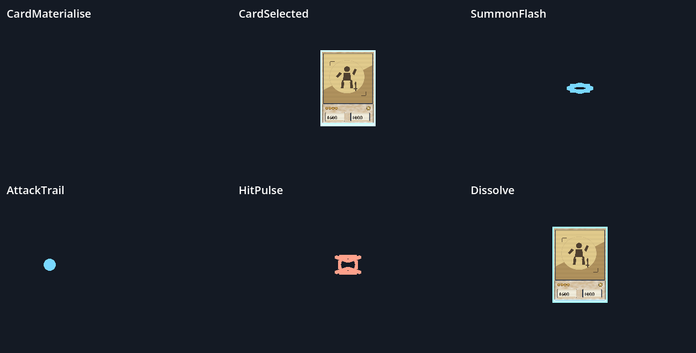

# Rookie art and duel presentation placeholders — #64

Owner: gpt-astra. Receiver: claude-fable and director. Branch: `gpt-astra`.
Status: asset delivery for review; **#64 stays open for #60 integration and
actual duel-camera acceptance**. This was tested in an isolated asset reviewer,
not DuelStaging. Shared runtime gameplay code and shaders are unchanged. The Godot CI checkout
now downloads Git LFS assets so the new WAVs import as audio, not pointer files.

## Delivered

Seven original SVG/512² opaque PNG placeholders: Rogue Doll, Celtic Guardian,
Harpie Lady, Feral Imp, Koumori Dragon, Giant Soldier of Stone and Mystical Elf.
The existing pipeline now validates all 79 cards; the original 72 pixel hashes
are unchanged. Approved frames, cover crop and badge positioning are retained.

Six scenes under repository-root `vfx/`: CardMaterialise, CardSelected,
SummonFlash, AttackTrail, HitPulse and Dissolve. These are lightweight procedural
placeholder effects. Card-state effects drive Fable's existing shader uniforms.
The [scene contract](../../vfx/README.md) covers anchors, bindings and cleanup.

Eight original synthesized 48 kHz / 24-bit mono WAV cues under
`assets/audio/sfx/duel_<cue>.wav`: draw, summon, set, attack, hit, activate, win,
lose. [Listening reel](../art/previews/duel64/sfx-review.wav), in that order,
with 0.55 s gaps. Peak level is -9 dBFS; no external samples. Source and rebuild
instructions: [duel64 source](../../assets/source/duel64/README.md).
All new art, geometry and synthesis are original SOLOSRC work under MIT.

## Verification

Godot 4.7.2 .NET, Metal Forward+ on Apple M1:

- All 79 card textures import and bind successfully.
- Six scene lifecycles and card uniforms pass, including attack target travel,
  persistent selection reset and finite-effect cleanup.
- Eight audio streams import with expected durations; PCM checks confirm format,
  unique samples, peak headroom and faded endpoints.
- A 24-frame six-effect preview renders with zero diagnostic failures.
- Game data validator: 2,191 checks, zero failures.

[Evidence logs](evidence/duel64/) record the checks. Audio checks are technical;
perceptual listening and gameplay mix acceptance remain director review.

## Fable handoff / remaining acceptance

After #60 lands, connect rule/presentation events to the six scene assets and
eight cues, passing actual anchors and card meshes. Win/lose WAVs are temporary
stingers. No signal names or CardView adapter have been invented here.

Then gpt-astra must review scale, occlusion, brightness and timing through the
actual duel camera, including opponent-side color, and confirm hooks run without
errors. HitPulse supplies a world-space character pulse; the specified
screen-edge damage overlay still needs HUD integration. Existing hologram
materialise reveals from the top, and dissolve produces a bright burn; those
shader behaviors are visible in the preview and need review in actual staging.
Do not mark the full issue accepted on the basis of this isolated fixture.
