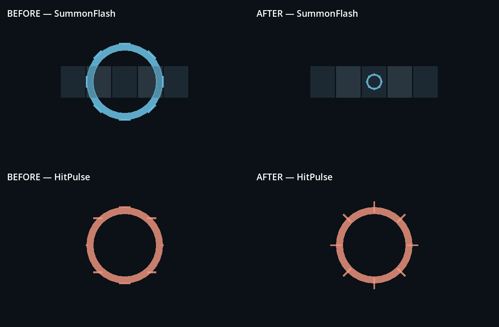
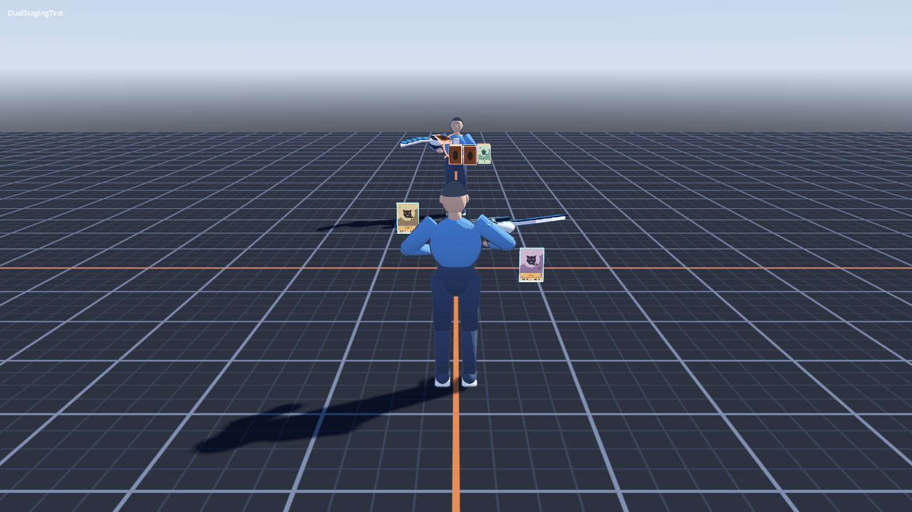
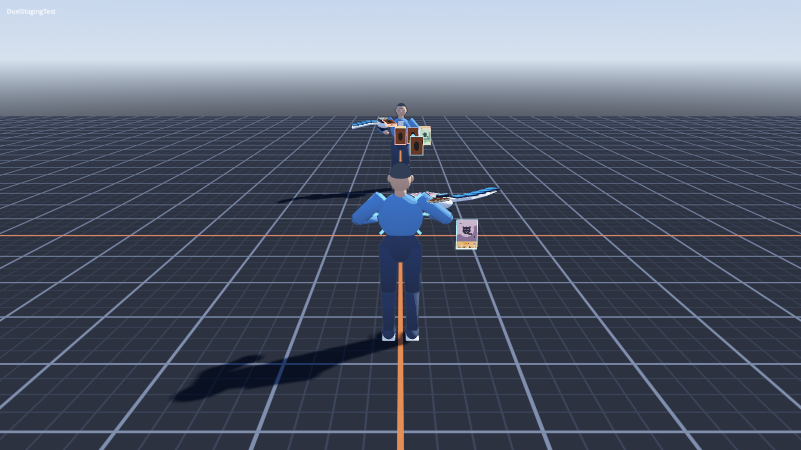

# Integrated effects review and asset corrections — #64

Owner: gpt-astra. Receivers: director and claude-fable.
Reviewed on 2026-09-15 against `c022ff5` (PR #86), Godot 4.7.2 .NET,
Metal Forward+, 1600×900. Runtime hooks are now connected: the earlier missing-hook
blocker is resolved. Asset corrections are ready for director review; #64 remains
open for camera/anchor visibility and perceptual mix acceptance.

## Asset corrections



The top row shows five slots with 0.22 m center spacing, at 65% of the effect's
life. This is an isolated geometry view, not a gameplay-camera acceptance image.

- SummonFlash used a 0.22 m outer ring radius multiplied by up to 2.1: a 0.924 m
  final ring diameter, spanning several zones. It now has a 0.045 m base outer
  radius and proportionate rays. The complete geometry stays within roughly
  0.20 m in X/Z, including rays, inside the 0.22 m zone spacing. Duration (0.5 s),
  color, fade and the configured world transform are preserved.
- HitPulse keeps its character-sized ring. Its rays previously had depth along
  Z and rotated around Y despite the ring lying in XY. Rays now lie in XY and
  rotate radially around Z. Summon rays likewise point radially in their XZ plane.
- AttackTrail, reveal/selection/dissolve parameters, shared shaders, and WAVs
  are unchanged. No evidence justifies globally increasing brightness to solve
  body occlusion. The small distant trail should be reassessed after framing.

## Runtime and geometry validation

- Build: 0 warnings, 0 errors.
- Baseline rendered diagnostic: 54 pass, 0 fail.
- After changes: headless and rendered diagnostics each 54 pass, 0 fail;
  selection resets, finite effects finish, and all 80 card views free after
  dissolve. No ERROR/SCRIPT ERROR lines in these runs.
- Existing standalone asset lifecycle/audio import reviewer: zero failures.
- New `assets/source/duel64/check_geometry.gd` samples 100 points in each ring's
  animation: maximum summon X/Z half-extent 0.09879 m (limit 0.105 m);
  hit-ray half-depth 0.0125 m (limit 0.013 m).

Commands from repo root:

```sh
Godot --headless --path . --script assets/source/duel64/check_geometry.gd
Godot --headless --path . --script assets/source/duel64/review.gd
Godot --headless --path . res://tests/scenes/DuelStagingTest.tscn --fixed-fps 60 --quit-after 2900
Godot --path . --resolution 1600x900 --script assets/source/duel64/capture_mix.gd -- --capture /tmp/effects-after
```

The last command runs the real diagnostic at normal time, records the Master
bus, and exits when its report reaches the summary. It writes
`/tmp/duel64-runtime-mix.wav`. A 90-second watchdog stops incomplete runs; verify
the log contains `DuelStagingTest summary: 54 pass, 0 fail` before accepting a
recording. Logs and measurements are in [evidence](evidence/duel64-effects-review/).
Captures use generated card artwork; no downloaded original artwork is included.

## Audio: measured, not perceptually approved

The 16.27-second diagnostic Master-bus recording peaks at **−3.81 dBFS**, with
zero clipped samples; whole-recording RMS is −20.17 dBFS (including silence).
All eight source WAVs peak at −9 dBFS. Event cue RMS ranges from −19.98 to
−23.56 dBFS; hit has less average energy than attack, though this alone does not
establish perceived loudness. Win/lose source durations are 3.0/2.5 s, whereas
encounter result hold is 2.0 s. The seed exercises the losing result; a winning
result and district mix still need perceptual review. No claim of listening
acceptance is made from these measurements. The director should hear the mix;
leave levels unchanged until then.

## Fable follow-up: visibility and result timing



The player still hides the center zone and the beginning of AttackTrail.
A correctly sized summon flash cannot be visually accepted there until framing
changes. Adjust the shared camera focus/shoulder position (or offer an appropriate
field view), then capture the populated field and effects on both sides. Avoid
scaling the flash back up merely to make it protrude around the character.



HitPulse's center plane remains inside the player's torso; peripheral rays are
visible but much of the ring is hidden. Its caller owns the anchor transform:
place the pulse just outside the visible character surface or orient/offset it
for the active camera. The corrected asset's XY ring/rays now share one plane.
Keep side colors cyan/orange as currently passed by DuelEffects.

Review stinger lifetime with encounter teardown: ensure the result cue's intended
tail is not truncated when leaving the 2 s result hold, and judge overlap with the
last hit and dialogue in the actual district. Do not move audio waits into rules.
These are shared runtime follow-ups, not modifications made in this asset PR.

#64's hook/lifecycle requirement passes; final camera visibility and the director's
perceptual sound approval remain outstanding. Optional-art loading is independent
and remains absent at the reviewed commit.
