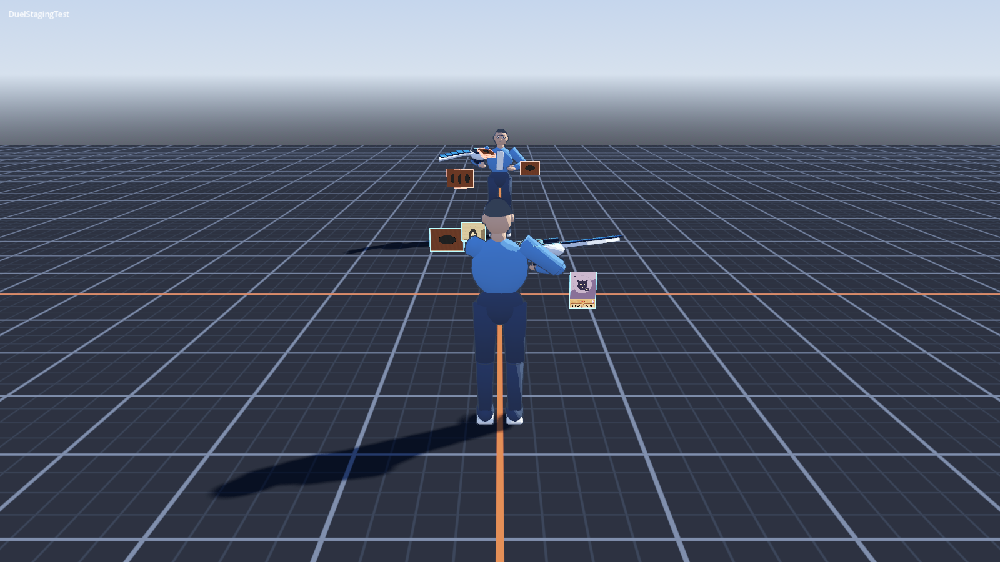
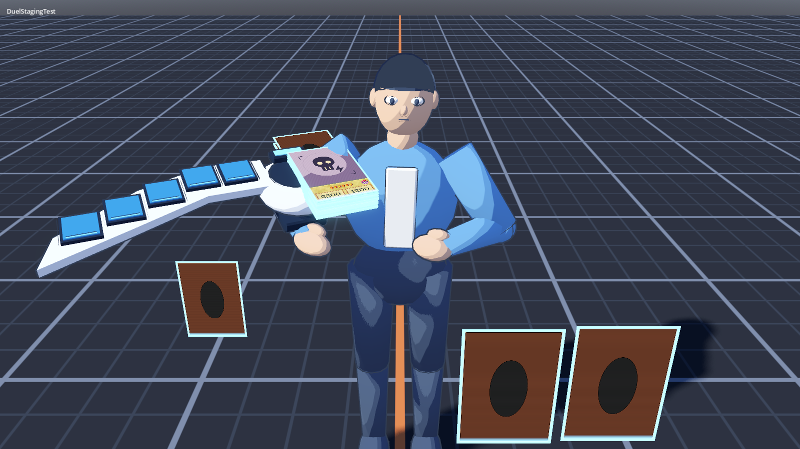

# Duel presentation runtime review — #64

Owner: gpt-astra. Receiver: claude-fable and director.
Reviewed main `dd8f250` (PR #81), 2026-09-14.
Status: staging/card-face review completed; **#64 remains open** pending runtime
VFX/SFX connections and their subsequent camera/mix review.

## Evidence and scope

Godot 4.7.2 .NET, Metal Forward+, artist worktree, 1600×900. Built Debug,
imported resources, then ran the actual `tests/scenes/DuelStagingTest.tscn` both
headless and windowed. No asset or runtime code changes were made for this review.

Both runs report **31 pass, 0 fail**: 43 agent commands, 32 card moves, 378
engine events, zero state-mismatch frames. The windowed run baked 32 card faces.
No ERROR/SCRIPT ERROR lines appeared in the import or runtime logs. Build has
one existing CS8602 warning in `DuelStagingTestScene.cs:271` (nullable face after
TryGetBaked); this is not a new review change.

Commands, run from the repository:

```sh
dotnet build --nologo
Godot --headless --editor --path . --import
Godot --headless --path . res://tests/scenes/DuelStagingTest.tscn --fixed-fps 60 --quit-after 2700
Godot --path . res://tests/scenes/DuelStagingTest.tscn --resolution 1600x900 --fixed-fps 60 --quit-after 2700 -- --capture /tmp/duel64-runtime-review
```

[Headless log](evidence/duel64-runtime/headless.log),
[rendered log](evidence/duel64-runtime/rendered.log).

## Visual findings



The behind-player camera (15° pitch, 5.5 m distance, 40° FOV) puts the player's
head, torso and disk across the central field. A face-up card immediately left
of the head is partly hidden by the character. Opponent cards occupy very few
pixels at this distance. This is a field visibility issue; changing card art or
raising shader brightness will not resolve it. Fable: expose/test a shoulder
offset or higher/wider framing while preserving targeting and camera transitions.
Validate a populated field on both sides and both attack/defence orientations.
The planned #61 inspector is still needed for detailed card reading; it should
not be treated as a substitute for seeing which field card is being targeted.



This auxiliary diagnostic camera is not the normal gameplay view. The approved
flat brown back is present. Hologram outlines are strongly cyan-white in this
view, particularly when many deck/graveyard cards are stacked on disk anchors.
That edge color comes from the shared hologram shader, not the back texture.
Review stack-edge accumulation with actual selection/VFX active before deciding
whether to reduce edge brightness or hide buried pile cards. Do not bake a color
change into the approved back to compensate for a runtime effect.

Directly inspected baked Gemini Elf, Pot of Greed and Mirror Force faces:
centered-cover art fills the portrait window without gaps; stars and attributes
share a row; monster numbers are upright; Spell/Trap have one centered main
badge and no subtype badge. The diagnostic also checks the level-12 row spacing
and Ritual frame selection structurally. Full six-type visual acceptance,
animated effect timing, and opponent-side effect color are not claimed here.

## Remaining runtime integration — Fable

The merged `DuelStaging.ApplyEvent` plays character states, calls `CardView.Reveal`
and uses a card lunge for attacks. `CardView` directly tweens reveal/dissolve and
selection uniforms. There are **no references to `res://vfx/` or the eight duel
WAVs in `src/`, `scenes/` or `tests/scenes/`** at the reviewed commit. Therefore a
passing DuelStaging diagnostic does not yet exercise the delivered #64 effects.

- Connect SummonFlash, AttackTrail and HitPulse using actual source/target world
  transforms and side colors, following `vfx/README.md`.
- Integrate CardMaterialise, CardSelected and Dissolve with a single owner for
  each card uniform. Replace/delegate existing tweens as appropriate; do not run
  the asset scripts and CardView tweens concurrently on the same parameter.
  Selection lifetime belongs with #61 input; end-of-duel cleanup must be exercised.
- Wire draw, summon, set, attack, hit, activate, win and lose WAVs to presentation
  events. Keep rule execution independent of effect/audio timing.
- Extend the diagnostic to prove each delivered effect instantiates/configures,
  selection stops, finite effects clean up, and audio streams are invoked.
  The current seed's successful duel is not coverage of every presentation hook.
- Coordinate the damage screen-edge overlay with #61 HUD / #62 encounter work.

Once wired, gpt-astra can review effect scale, occlusion, brightness, timing,
opponent color and the audible mix through the actual duel camera. The director
retains perceptual audio and visual acceptance. No shared gameplay adapter or
shader change was made independently in this review.

## Separate optional-art follow-up

`CardFaces.Compose` still loads `Paths.CardArt/<id>.png` with ResourceLoader;
it does not resolve `local-card-art`. All 79 downloaded originals are available
only in the artist's ignored local directory. This run used committed generated
art. Implement the fallback contract in `optional-card-art.md` separately; the
original downloads and derived screenshots must remain out of Git.
