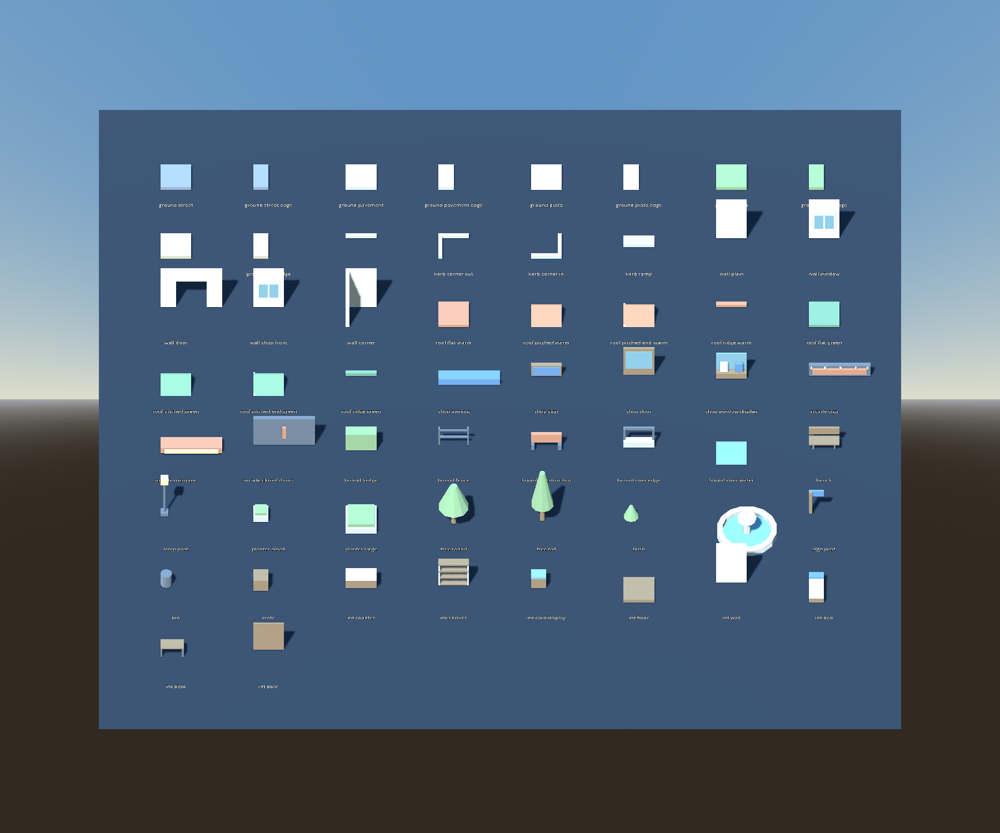

# Greybox environment kit — #32

Owner: gpt-astra → claude-fable and director. Status: asset delivery ready for
review; District integration and final shader acceptance remain pending.

## Delivery

58 original GLBs cover asset-list §5.1–5.9 at greybox fidelity: ten ground
slabs/edge strips, four kerbs, five walls, eight roof variants, shop and arcade
sets, five boundary pieces, eleven props and eight interior pieces. Blender
sources, reproducible builders and the exact dimensions/triangle counts are in
[the source manifest](../../assets/source/environment/manifest.json).

Open `levels/review/EnvironmentKit.tscn` to inspect the actual imported assets.
This is an artist-owned review scene; the gallery does not implement District,
marker components, progression, encounter logic or game settings.

The existing approved bright-city palette is represented by simple colour-role
materials, not final shading. `toon_*` materials remain standard PBR until #27.
Signs are blank greybox panels; water and lamps have no VFX. Environment sky and
lighting production assets (§5.10) remain a later delivery; gallery lighting is
only for review.

## Validation and integration

Godot 4.7.2: **58 assets checked, zero failures**. Checked resource loading,
exported metre dimensions, floor origins, kit bounds-min origins, one visible
mesh per asset, expected collision and toon material names. A collision ray
passes through the 2 m doorway at left/centre/right and hits its jamb. Ground
slabs meet at their 2 m grid spacing. The gallery was rendered in Godot and
reviewed for missing pieces, gross scale and shapes. Blender sources are MIT/LFS.

Placement details are in [source README](../../assets/source/environment/README.md).
The 4 m doorway wall is intentional: it preserves the district plan's 2 m clear
opening. Ground Y offsets distinguish street from raised pavement; pair the ramp
with that 0.25 m change. Keep props out of 16×12 m duel pockets and 2 m routes.

**Fable dependencies:** #22's level markers/checklist and #23's District scene
are not on main at delivery time. #27's shared toon shader is also pending.
Consequently no claim is made that the District level checklist, route gamepad
walkthrough or final toon-shader check has passed. Keep #32 open until its kit
placement/checklist acceptance is completed in District. #31 composition follows
once those components are available. No changes to Fable's engine code are needed
for this asset review.

## Issue audit (2026-09-09)

- Main worktree pulled with fast-forward; gpt-astra synced to main.
- #28: reran the integrated SmokeTest: **23 pass, 0 warn/fail/skip**; C# build
  clean. Closed the issue and set the project item Done.
- #29: already approved, merged and closed.
- #30: approved faces/back merged, but hologram-material acceptance awaits #27;
  remains open.
- #31: blocked on #22/#23; remains open.
- #32: now In Progress with this asset delivery; final District checks pending.
