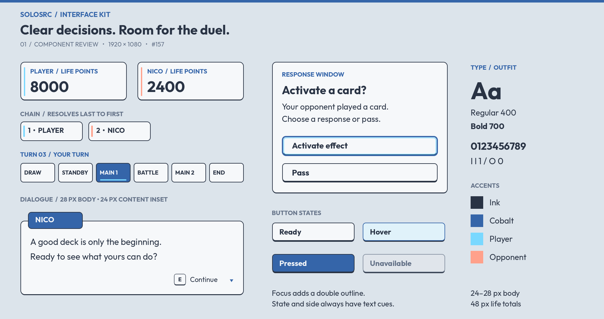
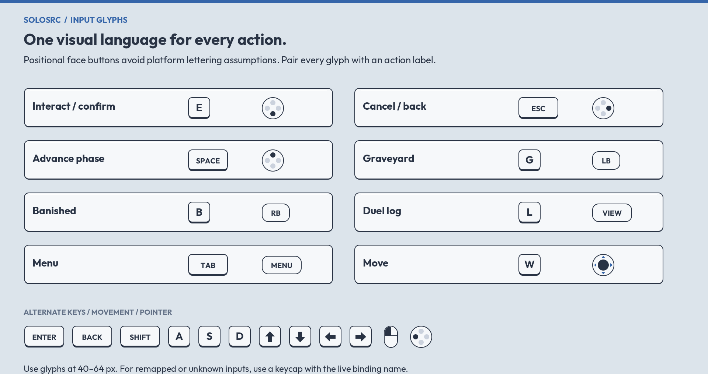

# #157 — Interface art kit delivery

Owner: gpt-astra. Receiving owner: claude-fable (#158 integration).
Status: ready for director visual review; not yet approved or integrated.
Branch: `astra/157-interface-art-kit`, based on `origin/main` at `fe8c31a`.
The PR's commit identifies the delivered version; obtain that branch/commit,
not uncommitted files from another worktree.

## Delivery

See [usage sheet](../../assets/ui/README.md) for the complete manifest, dimensions,
font installer, provenance, nine-slice margins, text sizes, states and input map.
The kit contains 45 original SVG/PNG assets, 16 StyleBoxTexture resources,
Outfit regular/bold FontVariation resources and two Godot review scenes.
Font binaries stay ignored under the approved style brief; the pinned installer
fetches the unchanged OFL font and its notice into the receiving checkout.

## Checks

- Godot 4.7.2 .NET on Linux: isolated import, all 45 textures and all supplied
  StyleBox resources loaded; both scenes instantiated and rendered at 1920×1080.
- Vulkan Mobile with llvmpipe rendered the evidence above. OpenGL could not
  initialise on this host; this is not a renderer performance assessment.
- Visually checked regular/bold distinction, Unicode labels, stretched panel
  corners, dialogue name tag, active phase underline, focus overlay, button
  states, side accents, all six phase labels and the default action glyph map.
- CairoSVG exports and Godot captures use the delivered PNG artwork. The font
  axis was corrected from a string key to the numeric OpenType tag after the
  initial Godot capture exposed a thin-weight mismatch.
- Runtime gameplay code was not changed. This is a kit/fixture check, not a
  populated-field, controller, television or in-game visual acceptance test.

## Fable's integration work

1. Install the font in your checkout. Apply styles to MessageBox, InteractionPrompt,
   DuelUi, list/response buttons and chain labels through #158. Keep their
   existing events and gameplay decisions.
2. Use live names, LP, chain numbers and phase states. Assign focus/disabled
   styles and glyphs from actual focus and bindings; preserve remapping and
   keyboard/mouse/gamepad behavior. The fixtures intentionally have no input code.
3. Verify the result with the actual duel camera, full hand/fields, long rules
   text, inspector, log and response windows. Check both sides and scaling.
   The specimen composition is not a requested redesign of those layouts.
4. Review asset-list entries 7.1–7.3 for a status update when this PR is accepted.
   Subsequent menu kit #198 can extend these panels and button states.

The director reviews visual treatment in this PR. In-game acceptance follows
integration; no approval is inferred from resource checks or these captures.
