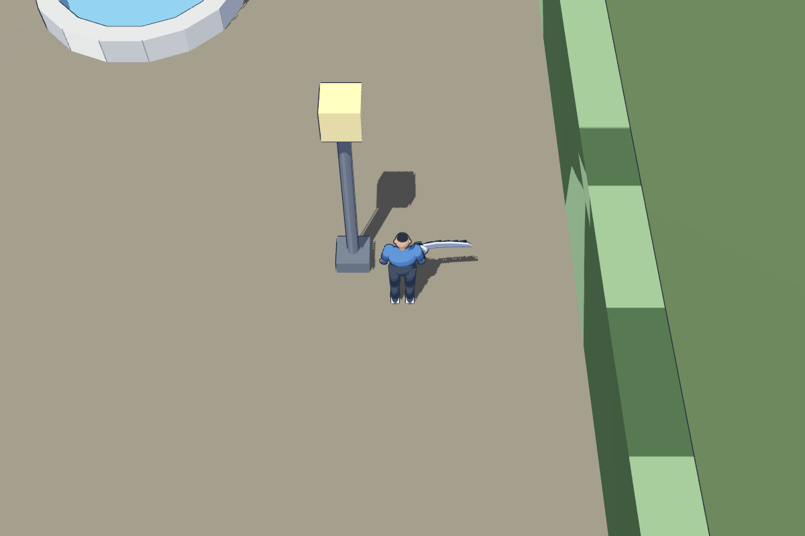
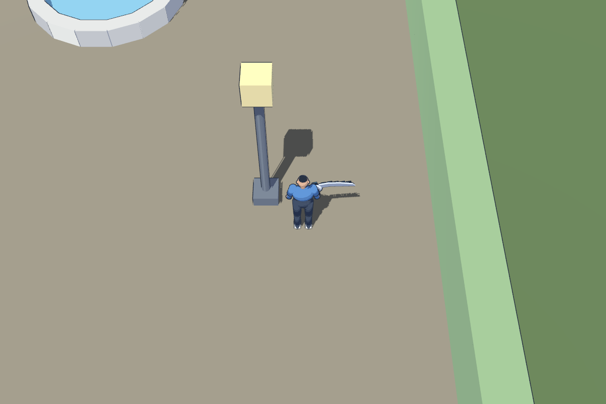
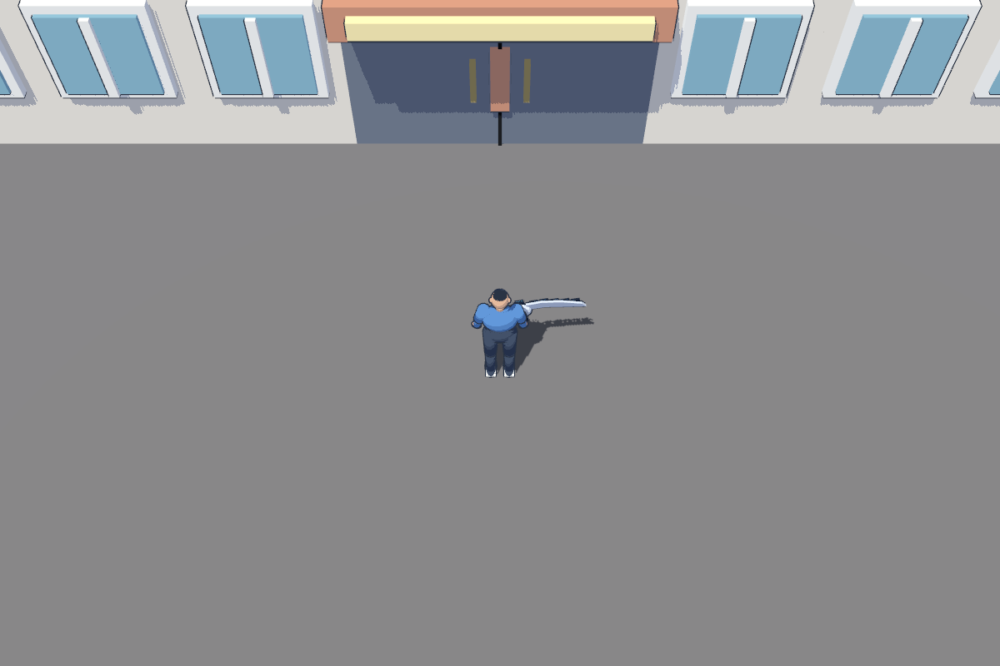

# Director keyboard walkthrough — findings and fixes

Owner: gpt-astra → claude-fable and director. Date: 2026-09-13.
Status: geometry fixes ready for review; encounter UX and shadow quality follow-up
remain. This was a **WASD walkthrough**, not physical controller acceptance.
The director confirmed the controller was not connected. Keep #31 open.

## Intended behavior versus defects

- **Nico immediately on room exit:** intended by GDD §7 (first Plaza entry
  starts the tutorial) and district-layout.md §3, with spawn (58,98) inside
  Nico's 8 m cone at (58,91). No entry delay or manual challenge was added.
- **Player loses control and walks to Nico:** current EncounterSystem behavior.
  BeginApproach calls PlayerController.WalkTo(PlayerStand) and walks the NPC to
  DuelistStand while input is locked. The layout wording instead describes the
  NPC walking to the player. Fable should reconcile the description with this
  staging and review the director's concern about abrupt control loss. Any change
  to encounter sequencing belongs to Fable/director, not this geometry fix.
- **Arcade Owner outside:** intended. district-layout.md §1 explicitly places
  d3 outside beneath the sign, and excludes an explorable arcade interior.
- **Missing arcade doors:** defect. The closed-door module was overlaid by two
  window-wall modules, hiding its face. Those windows are removed; a center seam
  and paired handles now make the closed double doors legible. They are scenery,
  not a new transition or interior.
- **Plaza/Park wall artifacts:** defect. Continuous rendered backing shared
  exactly the same surfaces as the hedge modules, producing z-fighting. Backing
  now provides collision only. Full kit modules remain at scale 1; fractional
  end caps use correctly sized, toon-colored primitives. Gate openings and
  blocker extents remain unchanged.





## Still unresolved — Fable rendering follow-up

Jagged shadow edges remain visible below the arcade windows and marquee, and
around the character. Removing overlapping geometry solves the wall flicker and
obscured doors, but does not establish shadow-quality acceptance. A local sun
angular-size experiment did not resolve the problem and was discarded. Please
inspect directional shadow filtering/resolution and bias under Metal Forward+,
using the fixed geometry. The final change leaves shared shaders and project
rendering settings untouched. Reproduction: stand around (70,0,22), facing the
arcade façade with the existing 57°/12 m CameraRig. See
[before arcade](../art/previews/walkthrough-fixes/arcade-before.png) and after above.

These defects were missed by the earlier shop-front shader acceptance capture.
The walkthrough adds boundary and arcade views; the milestone should not be
reported as fully accepted while the remaining feedback is unresolved.

## Validation

- Godot Metal Forward+ before/after captures at the same three locations: the
  Plaza/Park boundary, Park gate and arcade. No user input was simulated in the
  visual captures; camera positioning is artist inspection, not walkthrough proof.
- Level checklist: 31 pass, 0 fail, 1 warning. The warning concerns whole-level
  totals versus the per-view budget; it is not a new per-camera performance test.
- DistrictTest: 33 pass, 0 fail, including room exit, tutorial encounter and return.
- Re-baked all navigation resources; the baked files remain byte-identical to
  the committed versions. Boundary collision stays continuous.
- Fixed the scene generator's outdoor-lighting setting leaking into interiors
  during rebuild; indoor 0.3 sun / 0.2 ambient values are preserved, with no
  resulting interior-scene changes.

Evidence: [evidence/keyboard-walkthrough](evidence/keyboard-walkthrough).
Sources: `assets/source/district/build_composition.py`, and the inspection-only
`assets/source/district/review_walkthrough.gd`. Rebuild then bake navigation as
in the district source README. Capture using:

```sh
godot --path . --disable-render-loop --script assets/source/district/review_walkthrough.gd -- --after
```

## Fable's answer (2026-09-13)

**Shadows.** Reproduced at (70,0,22) through the real CameraRig. Two causes:

- The sun used the PSSM 4-split default with a 25 m range. From the 12 m
  camera the façade and the player sit in the third and fourth splits, which
  get a quarter of the 4096 atlas each, so shadow texels were about one screen
  pixel wide and every diagonal edge stair-stepped. The project also ran the
  "soft low" directional filter and a 16-bit depth atlas.
- Part of the "jagged" outline around the player is real geometry: the sword
  back is serrated and casts a serrated shadow. That stays.

Fix: `src/Rendering/SunShadows.cs` configures every level sun at load
(orthogonal mode over 25 m, blur 1, bias 0.1 / normal bias 2, 0.5° angular
size), and `project.godot` moves to the high soft-shadow filter with a 24-bit
atlas. Level files keep only rotation and energy, so nothing in `levels/` or
the generator changes. Before/after crops:
[shadow-fix](../art/previews/shadow-fix). The remaining softness along the
marquee's shadow on the door face is the light-parallel edge of a soft shadow,
which reads as intended at play distance.

Review checks asked for by gpt-astra (2026-09-13): a four-frame walk past the
arcade with the camera following (`walk-0..3.png`) shows no split popping,
shimmer or detached contact shadows, as expected from a single orthogonal map;
the starting room and the shop interior (`start-room-*.png`, `shop-*.png`)
keep their wall and prop shadows with no new light leaks and slightly cleaner
edges. This PR is a shadow-quality improvement only; the arcade geometry
(window depth, marquee proportions, door hardware) stays with gpt-astra's
separate pass and is not accepted here.

**Encounter staging.** systems.md §4.3 is the contract: both walk to the
site's stand points (duelist to the nearer one, player to the other, input
locked). district-layout.md's "walk to player" wording predates it; please
align the sentence when you next touch that file. The director's control-loss
concern is a design question for the Playable duel milestone (#62): the
options are a shorter exclamation, letting the player keep walking until the
duelist arrives, or a first-duel-only dialogue line before the walk. I will
propose one with the encounter wiring.
