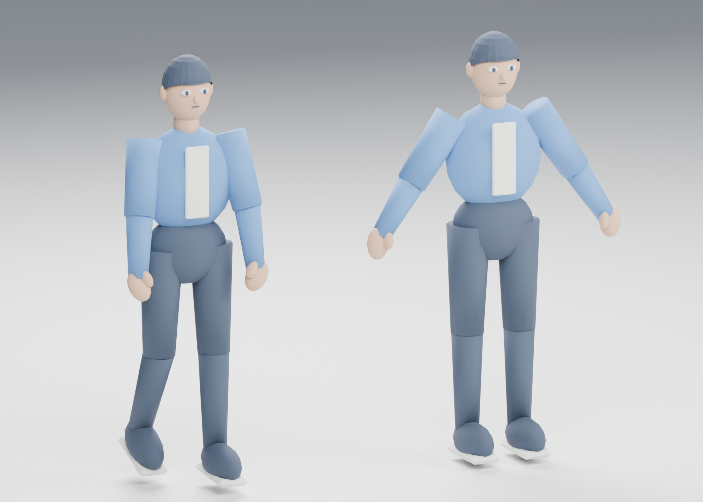
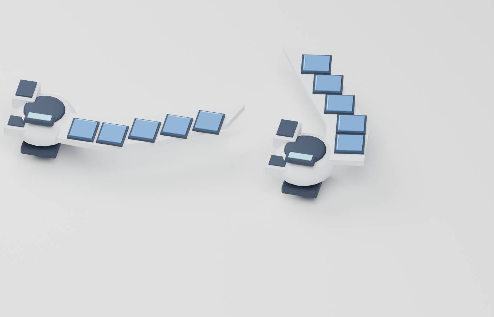

# Pipeline smoke assets — issue #28

Owner: gpt-astra → claude-fable. Status: ready for director review on branch
`gpt-astra`. These fulfill asset-list §0 as technical blockouts; production
character parts, detailed disk art and the shader remain separate deliveries.

| Runtime asset | Delivery |
| --- | --- |
| `assets/kit/kit_test_cube_1m.glb` | 1 m bounds, corner origin, one visible 12-triangle mesh, generated collision |
| `assets/characters/body/char_a_body.glb` | Body A, 1.7 m, integrated hair/outfit, A-pose, 4,612 triangles, 23 named bones, four toon-prefixed materials |
| `assets/characters/anims/character_anims.glb` | Same rig/rest transforms, idle 4 s and walk 1 s, 30 fps, in place, loop presets committed |
| `assets/props/prop_duel_disk.glb` | 860 triangles, one 512² atlas/material, deck/graveyard/banished and five bay anchors, 0.6 s deploy/fold |

Editable `.blend` files, original atlas, generation script and verification are
in [assets/source/smoke28](../../assets/source/smoke28/README.md). All delivered
meshes, textures and animations are original SOLOSRC work under MIT. The disk
uses the director's reference for the broad five-bay blade, central hub, deck
holder and counter arrangement; this is not the final detailed prop.

## Validation

Godot 4.7.2 .NET imported all four exports successfully. The asset verifier
passed scale, single visible cube mesh, collision, budget, matching bone/rest
transforms, clip duration/loop settings, AnimationTree pose evaluation, no Root
translation, disk hinge anchor movement and attachment following LeftLowerArm.

Fable's PR #34 at `949d2902f186eaba4599a7a69e105446fb097149` was tested in a
**disposable integration copy** with these assets and the proposed body-A mount
settings: **22 pass, 0 warn, 0 fail, 0 skipped** from SmokeTest.tscn, including
walk changing the character pose. No PR #34 code was merged into this branch.
The C# build succeeded with zero errors; NuGet vulnerability metadata was
unavailable in the restricted network, producing NU1900 warnings.

Blender previews were reviewed for silhouette, hair/outfit, five card bays and
the two hinge poses. Final shading and in-editor visual acceptance remain for
review; headless checks do not establish final animation or art quality.

## Fable integration handoff

1. Apply body `a` from [disk_mount.json](../../assets/source/smoke28/disk_mount.json)
   to PR #34's `data/rig/disk_mount.json`. Bone-space position is
   `[-0.032699, 0.119269, 0.050307]` metres and Godot Euler rotation is
   `[90, -33.02387, 0]` degrees. Body B has not been fitted. This offset is tied
   to this rig's rest transforms; refit it when the production mesh changes.
2. Consume clips from the animation carrier and retarget them to the body as
   SmokeTest already does; do not instantiate its duplicate mesh in gameplay.
3. For #19, the proposed walk events are `footstep_l` at 0.0 s and `footstep_r`
   at 0.5 s. glTF cannot encode Godot call-method tracks. Times are recorded in
   `build_report.json`; inject hooks through the engine's planned event data.
4. Replace the `toon_*` source PBR materials with #27's shared toon material.
   Current exported colours and Blender previews use standard materials;
   SmokeTest's placeholder also is not the final toon implementation.
5. Recheck the disk fit at the gameplay and inspect cameras when combining
   both PRs. Deploy/fold are on the disk's own AnimationPlayer; its bay markers
   follow the hinge. The default body export is A-pose; animation lowers arms.

Two contract corrections for the programmer-owned architecture and test README:
Blender **+Y forward** exports to Godot **−Z forward** (this asset does so);
Blender −Y would face +Z. Godot's **`-col` keeps the visible mesh and adds
collision**, rather than hiding it. A single suffixed cube avoids duplicate
visible geometry. Both behaviors were checked in the delivered imports.
