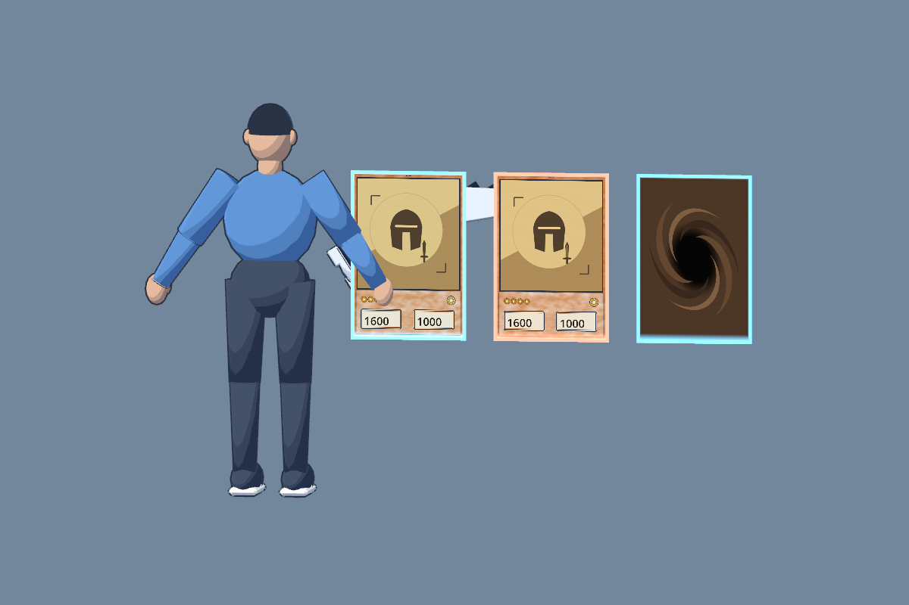
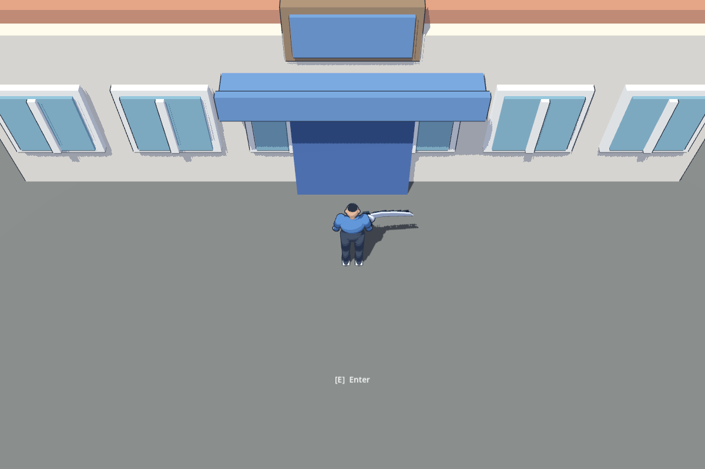

# Skeleton shader art review

Owner: gpt-astra → claude-fable and director. Status: artist review complete;
material/daylight tuning proposed for director approval. Reviewed merged PR #51
in the gpt-astra worktree, using Godot 4.7.2 Metal Forward+ on Apple M1.




## Answers to Fable's six questions

1. **Keep three bands and threshold 0.55.** They preserve volume on limbs and
   the disk. The glossy spots were the highlight, not excessive band count:
   specular_strength is now 0, rim_strength 0.15 (from 0.05 and 0.35).
2. **Keep the cool shadow tint #B3BDE6 and floor 0.38.** The brighter outdoor
   environment preserves blue fabric and warm building colors without making
   shadows neutral grey. No palette override is needed.
3. **Keep outline width 0.015 m / distance scale 0.8.** The contour is readable
   on the character at exploration distance and does not need a separate thick
   character material for Skeleton. Close captures expose hard-normal seams;
   those are model polish, not a reason to thicken every object.
4. **Increase district sun 0.3 → 1.0 and ambient 0.2 → 0.35.** This restores the
   bright daylight brief. Direction, shadow distance, camera and geometry are
   unchanged. Runtime District, artist inspection assembly and the authoring
   generator carry the same values. Interior lighting is unchanged.
5. **Keep edge glow 1.8 and current side colors; leave bloom off for now.** Set
   face_opacity 0.97, tint_strength 0.06 and scanline_strength 0.08 on both side
   materials. The print and numbers survive better while edges still identify
   the side. Final bloom and selection contrast need the actual duel environment.
6. **Accept small hard-corner outline gaps for the greybox kit.** A bevel/normals
   pass belongs to dressed art. Do not smooth every wall globally, which could
   spoil planar shading. No mesh exports changed here.

## What was actually inspected

- Real Game district at the shop through its existing CameraRig, with baseline
  and proposed lighting captured in the same run.
- Actual Character scene with the shared toon material; original Blade Knight
  placeholder art composed with the approved frame, stars, attribute and 1600 /
  1000 labels, rendered through both hologram side materials. The reverse uses
  the current approved card back. These review quads are deliberately enlarged
  to 0.5 m wide, so this establishes close shader readability, not game-scale UI
  acceptance. The card font is Godot's default review font, not a font delivery.
- CameraFraming with the actual 0.20 m cards from the 12 m exploration camera:
  positions and edge colors are visible, but stats cannot be read at this scale.
  Duel camera / inspector implementation must handle reading, as planned.
- Selected, half-reveal and fully dissolved instances in
  [card-states.png](../art/previews/shader-review/card-states.png). The dissolved
  card disappears and the reveal edge is visible. Static captures do not prove
  animated transition quality or hover feel.

Fable follow-up: the half-reveal capture exposes the **top half** of the face,
where the shader README says the wipe starts at the bottom. Please reconcile
UV direction and the documented animation direction when wiring the VFX tween.
No shared shader or engine code was changed by this artist review.

## Acceptance and remaining work

Artist acceptance of the Skeleton greybox kit's shader/style integration is
complete with these proposed settings. This PR can close #32 when the director
accepts it. It does not claim production models, dressed environments or final
animation polish. #31 stays open for the physical gamepad walkthrough; no
controller-feel acceptance was performed here. #27 and #30 are already closed
on GitHub; this review records the visual evidence and remaining duel-stage
integration limits without silently reopening them.

## Verification and reproduction

- .NET build: zero warnings/errors.
- Forward+ SmokeTest: 32 pass, zero warnings/failures/skips.
- DistrictTest: 33 pass, zero failures.
- CameraFraming rendered with the shared materials on six cube surfaces and
  twenty hologram anchors. This run used interactive inspection mode, not its
  headless numeric assertions.
- All seven screenshots saved successfully; no shader compilation errors in
  the render/diagnostic logs. Evidence: [evidence/shader-review](evidence/shader-review).

The artist-only capture script is
[`assets/source/shader-review/review.gd`](../../assets/source/shader-review/review.gd).
It resets comparison values in memory before capturing, then applies the tuned
values; it does not write resources. Render with Forward+ (not Compatibility):

```sh
godot --path . --disable-render-loop --script assets/source/shader-review/review.gd
godot --path . --disable-render-loop --script assets/source/shader-review/review.gd -- --framing
godot --path . --disable-render-loop --script assets/source/shader-review/review.gd -- --smoke --inspect
```

[Original character/card settings](../art/previews/shader-review/character-cards-before.png)
· [Original district light](../art/previews/shader-review/district-before.png)
· [SmokeTest](../art/previews/shader-review/smoke.png)
· [CameraFraming](../art/previews/shader-review/camera-framing.png).
