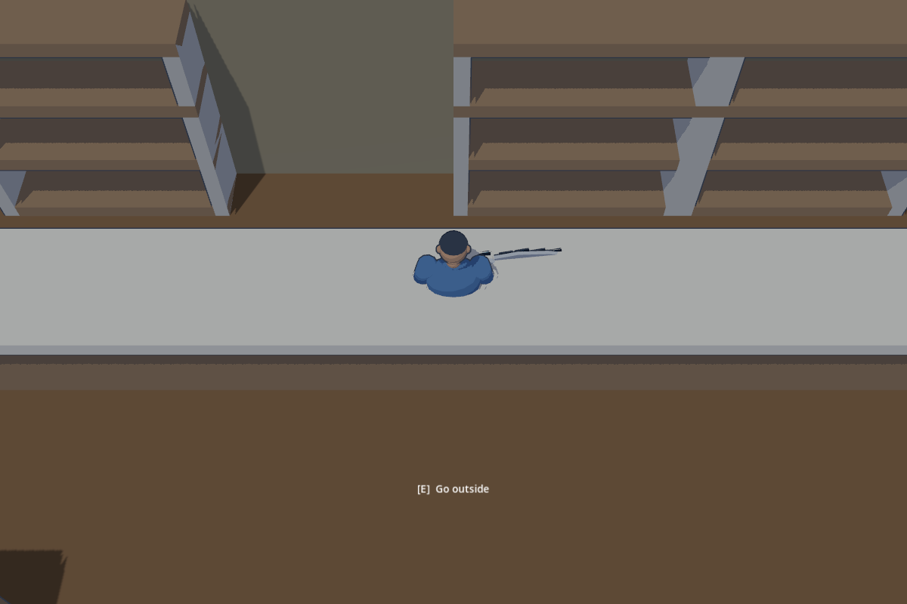
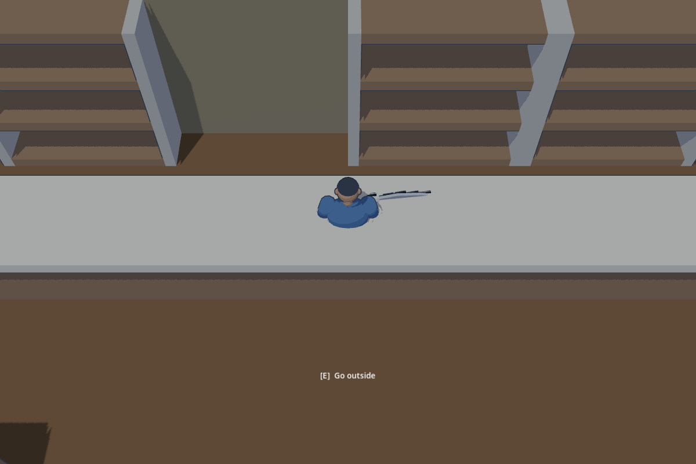
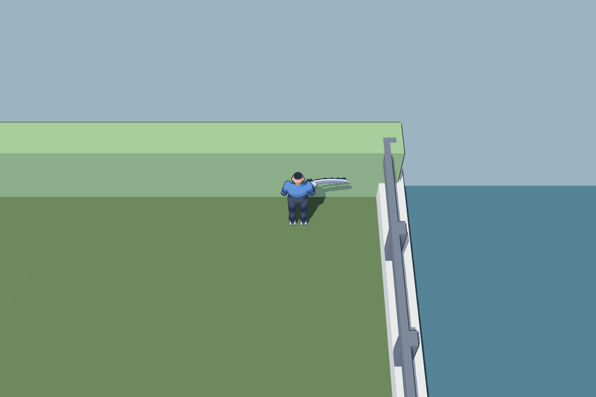
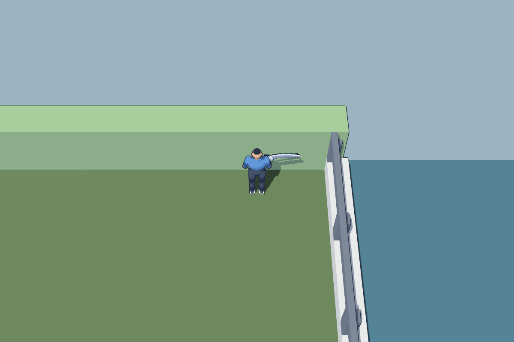
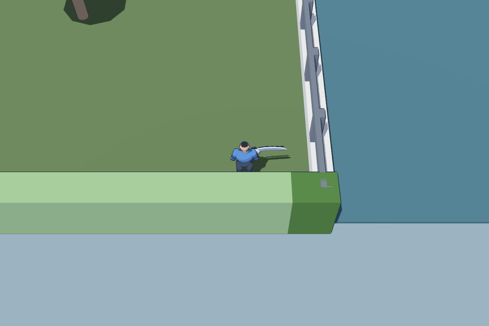
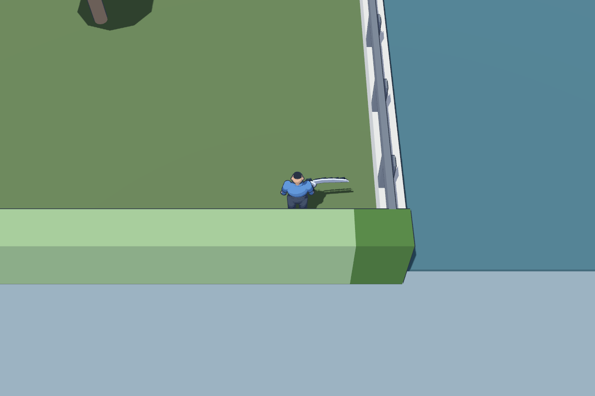

# Shelf and river rail overlapping faces

Owner: gpt-astra. Status: ready for director review. Original SOLOSRC MIT assets.

Director reported shelf z-fighting and the top rail clipping into the green wall.
The shelf boards crossed the uprights, leaving coincident front and top faces.
River posts similarly overlapped the top bar; the end modules also crossed the
hedge faces at Z=40 and Z=104.

Boards now span only between uprights; posts terminate beneath the top bar.
The visible river rail runs from Z=40.375 to Z=103.625, meeting the inner hedge
faces. A dedicated 1.25 m end module closes the span at scale 1. Collision backing
remains continuous. Sun, shaders and gameplay code are unchanged.

| Location | Before | After |
| --- | --- | --- |
| Shop shelves |  |  |
| North rail/hedge join |  |  |
| South join |  |  |

Sources: `assets/source/environment/build_environment.py` and affected `.blend`
files; placement in `assets/source/district/build_composition.py` generates
`levels/district/areas/Edge.tscn`. Review gallery includes the new end module.
Reproduce captures with `godot --path . --disable-render-loop --script
assets/source/district/review_shelf_rail.gd -- --after`.

Godot 4.7.2 Metal Forward+: 60 kit assets validated, zero failures; level check
31 pass, zero failures, one existing whole-level budget warning. DistrictTest
33 pass, zero failures. Navigation rebake did not change saved navmeshes.
Static runtime before/after captures verify the reported joints; this is not a
claim of a complete moving-camera or shadow-quality audit.
[Evidence](evidence/shelf-rail-fix/).
