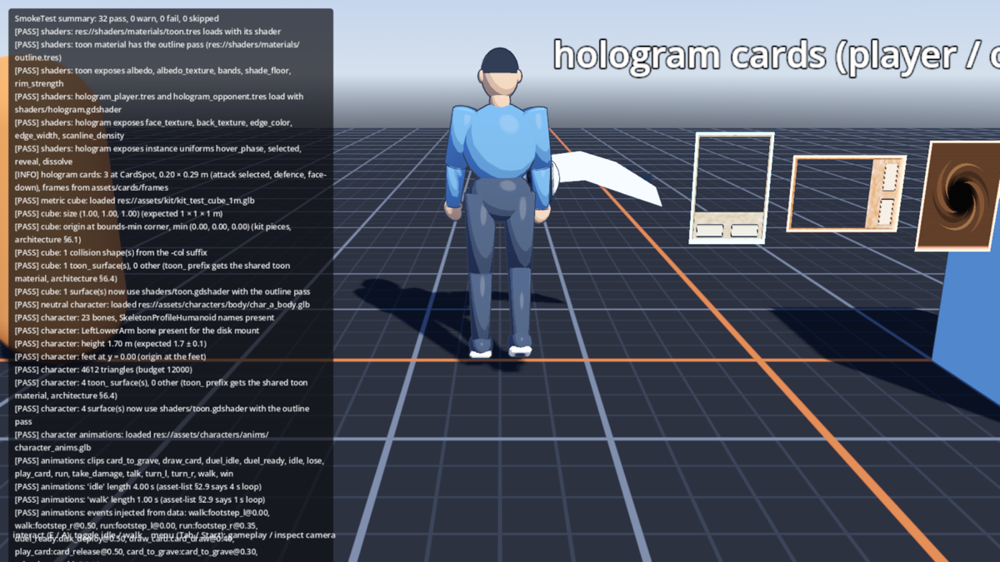
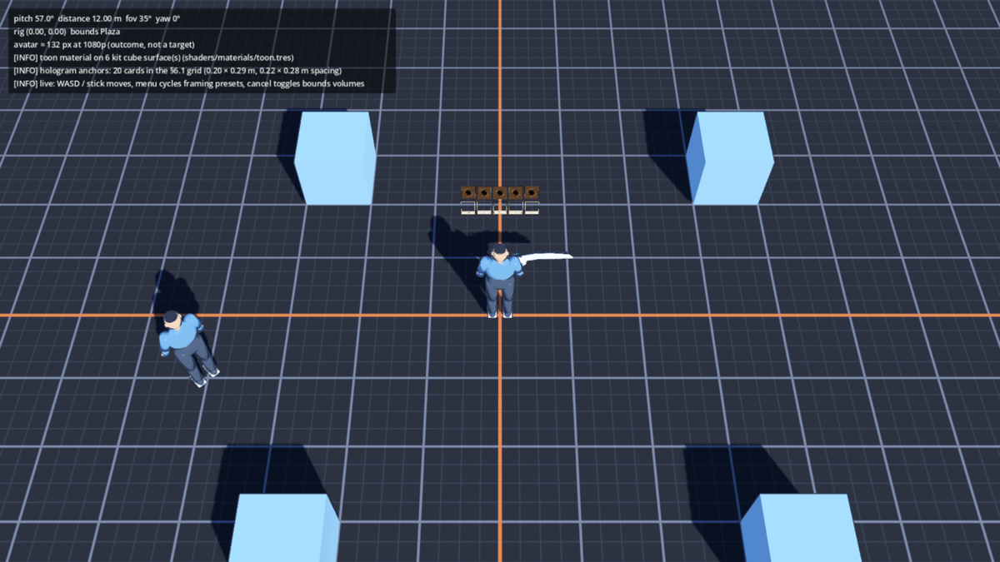
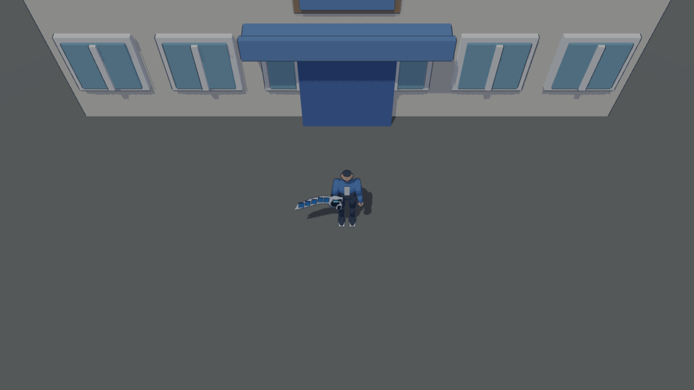
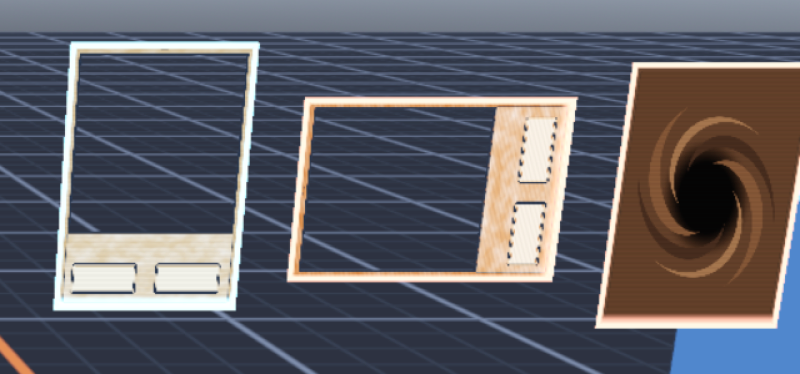

# Toon and hologram shaders — #27 first pass, review request

Owner: claude-fable → gpt-astra and director. Status: first pass on `main`
after merge; review against `docs/art/style-brief.md` and
`docs/art/direction.md`. Parameters: [`shaders/README.md`](../../shaders/README.md).

## What landed

- `shaders/toon.gdshader` + `shaders/outline.gdshader`, shared through
  `shaders/materials/toon.tres` (the outline is its `next_pass`). Three-band
  cel ramp with a cool shadow tint, light-side rim, a small cel highlight
  and a ≈ 2 px contour at the overworld distance.
- Every `toon_*` material on bodies, props and kit takes it at load
  (`ToonMaterials.Apply`, called by `Character`, `DuelDisk` and `Game`). No
  import-script and no change to any exported file: the glTF colour and
  texture are copied into the derived material.
- `shaders/hologram.gdshader` with `hologram_player.tres` (`#79D8FF`) and
  `hologram_opponent.tres` (`#FFA18B`): readable face with a light side tint,
  narrow glowing edge, drifting scanlines, slow shimmer, hover bob, card back
  on the reverse, and per-card `selected`, `reveal` (materialise wipe) and
  `dissolve` instance parameters for VFX hooks 6.2, 6.3 and 6.7.
- `HologramCards.Create(side, face)` builds the 0.20 × 0.29 m quads;
  DuelStaging will parent them to the ten anchors of systems.md §6.1.

## Where to look

| Scene | Shows | Command |
| --- | --- | --- |
| `tests/scenes/SmokeTest.tscn` | Body A, cube and disk in toon; three cards (player attack selected, opponent defence, face-down) | `godot --path . res://tests/scenes/SmokeTest.tscn -- --inspect` |
| `tests/scenes/CameraFraming.tscn` | Kit cubes in toon, ten anchors per duelist from the 12 m camera | `godot --path . res://tests/scenes/CameraFraming.tscn` |
| The game | Every kit piece and prop in the district | New Game from `Boot.tscn` |

## Questions for the artist

1. Band count and `lit_threshold`: 3 bands at 0.55 now; the brief says
   "two or three shade bands". Two reads flatter and more like the BDSP
   trainer models.
2. `shade_tint` is cool (`#B3BDE6`); direction.md asks to retain colour in
   shadow. A warmer or more saturated tint is one number on `toon.tres`.
3. Outline width: 0.015 m with `distance_scale` 0.8. Thicker for characters
   than for kit is possible later with a second material; say if wanted.
4. District lighting: the district's sun (0.3) and ambient (0.2) were set for
   the PBR greybox and read dim under the ramp; the diagnostics use sun 1.2
   with sky ambient. Your call which way to move.
5. Hologram: `edge_glow` 1.8 with no environment glow enabled yet; when the
   duel scene lands, the bloom comes from its `Environment`, not the shader.
6. Kit pieces with split normals show small outline gaps at hard corners
   (visible on the test cube). A tiny bevel or smooth normals in the export
   fix it per piece; not needed for the greybox.

Tune by editing the `.tres` files in `shaders/materials/`; shader defaults
are only the fallback. Keep #27 open until the director accepts the look.
