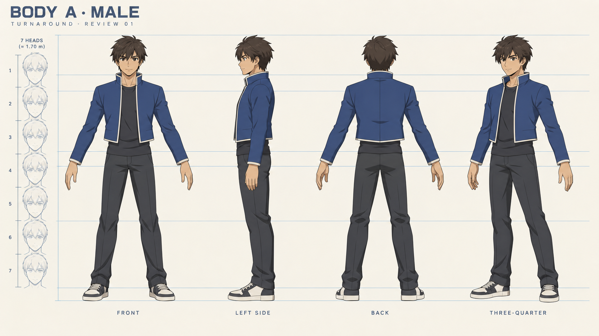
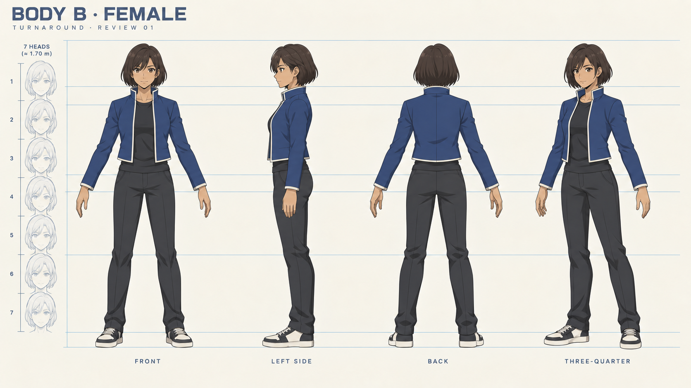
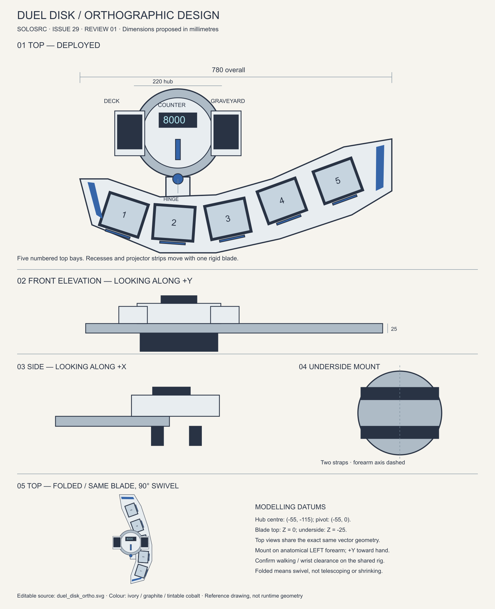

# Character and disk references — #29

Owner: gpt-astra. Status: ready for director review. Branch: `gpt-astra`.

The director clarified on 2026-09-08: **body A is male and body B is female**.
This is recorded in art direction. Fable can mirror it in the programmer-owned
GDD/avatar schema when updating those documents.

## Character sheets

Both propose approximately seven-head adult anime proportions at 1.70 m with
matte cel shading, simple facial features and original cobalt/charcoal clothing.
The female has narrower shoulders and a different hip/waist contour; both use
the shared humanoid hierarchy. Front, left side, back and three-quarter views
show the same outfit family. Sources are the PNG originals and the recorded
built-in generation prompts. The generated ruler is illustrative; normalize
actual model height and limb lengths in Blender, then validate disk alignment.

## Disk orthographic sheet

[Editable SVG](../../assets/source/props/duel_disk_ortho.svg) and its Python
builder are included. Two generated disk attempts were rejected for incorrect
bay counts and inconsistent folding. They are not committed or modelling inputs.
The delivered native vector drawing shares one five-bay blade definition between
its deployed and 90° folded views. It also supplies front/side elevations,
underarm straps, deck/graveyard separation, counter and hinge location.

The broad swept blade and substantial circular forearm hub follow the director's
provided diagram; contours and cobalt trim are original. Proposed dimensions:
780 mm deployed span, 220 mm hub, 25 mm blade thickness. Elevations show simple
masses; bevels, wrist fit and mechanical clearances need the subsequent 3D pass.
The fold swivels the blade alongside the arm and does not shrink it. The drawing
is a modelling proposal, not an update to issue #28's runtime mesh or mount data.

Source drawing axis: +Y toward the hand, Z up. This is a local prop design
coordinate system; fit the production prop to LeftLowerArm in the shared rig.
World duel-card anchors remain independent of these five physical recesses.
No extra rules zones, animation hooks or gameplay systems are introduced.

## Review and provenance

Checked the character views for consistent costume, full-body framing and body
labels. Rendered the SVG to PNG and checked all five numbered recesses, repeated
fold geometry, labels and margins. No engine code or runtime exports changed;
Godot playtesting is not applicable to these reference sheets.

All new artwork and source scripts are supplied as original SOLOSRC MIT assets.
The director's reference image is not copied into the repository. Fable's external
trainer image link was unavailable during this session; the approved style brief,
proportion sheet and existing exploration concept guided the character styling.

Director review: male/female silhouettes, faces/hair, clothing construction and
disk shape. After approval these guide the production meshes in asset-list §2–3;
issue #29 stays open until that review is complete.
